# Lab 11: Creazione di segmenti con Copilot for Customer Insights - Data (anteprima)

## Esercizio 1: Aggiungere i data

1.  Accedi all'ambiente **Customer Insights - Data** utilizzando il link
    indicato **https://home.ci.ai.dynamics.com/**. Nel riquadro di
    spostamento a sinistra, seleziona **Data** \> **Data sources**.

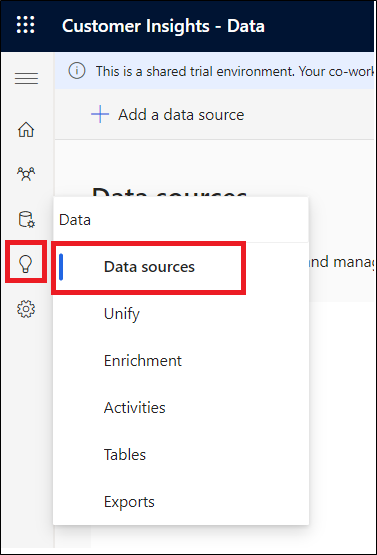

Nota: Chiudi il pop-up **– Introducing Copilot in Customer Insights -
Data**.

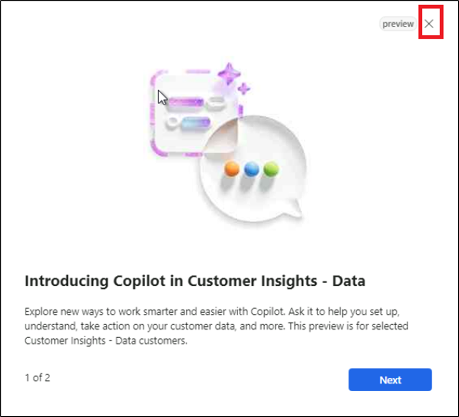

2.  Seleziona **Add a data source**.

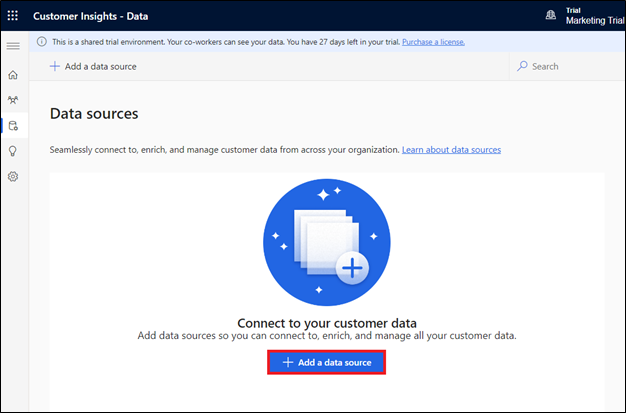

3.  Selezionare **Microsoft Power Query**.

4.  Immettere **GroceryContacts** nel **Data source Name** per l'origine
    data e selezionare **Next**.

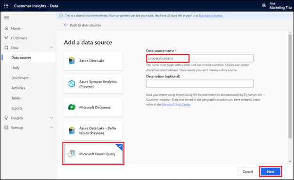

5.  Nella pagina **Choose data source** selezionare **Text/CSV**.

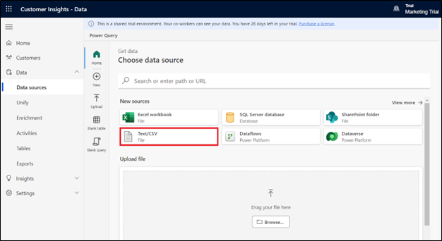

6.  Nella pagina **Connection settings** selezionare **Upload file** e
    quindi selezionare **Browse**.

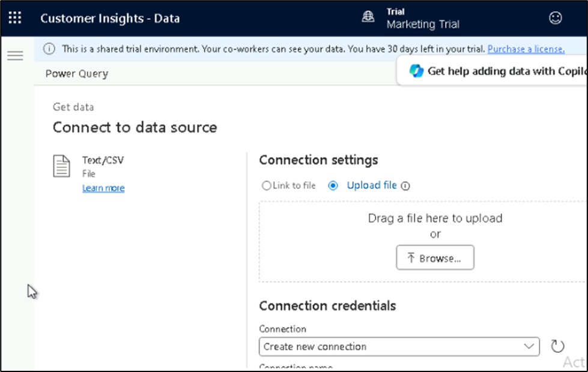

7.  Selezionare **Grocery_Contacts.csv** da **C:\LabFiles** nella **VM**
    del lab. Seleziona **Open**.

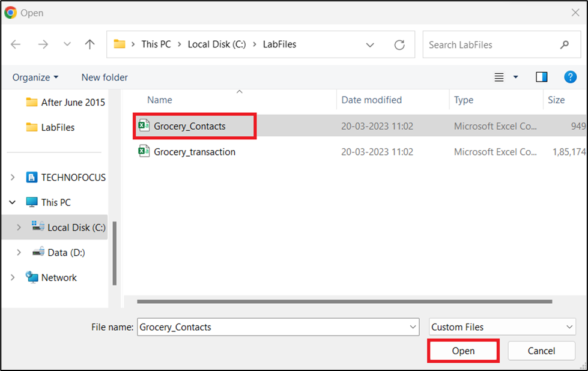

8.  Seleziona **Sign in,** per accedere al suoi account.

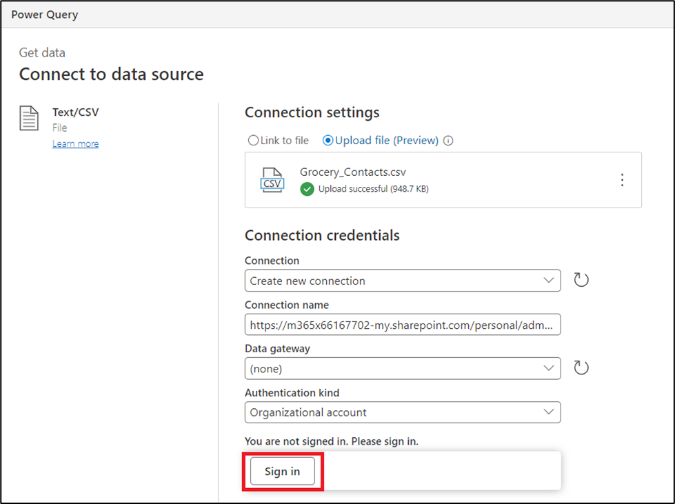

9.  Immettere le credenziali del **Office 365 admin tenant**.

10. Seleziona **Next**.

11. Nella pagina **Preview file data,** selezionare **Transform data**.

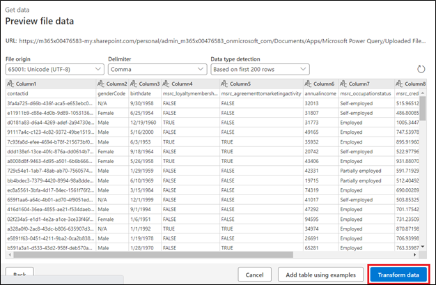

12. Nella pagina **Transform data** passare alla barra multifunzione
    **Transform** e quindi selezionare l'opzione **Use first row as
    headers \> Use first row as headers.**

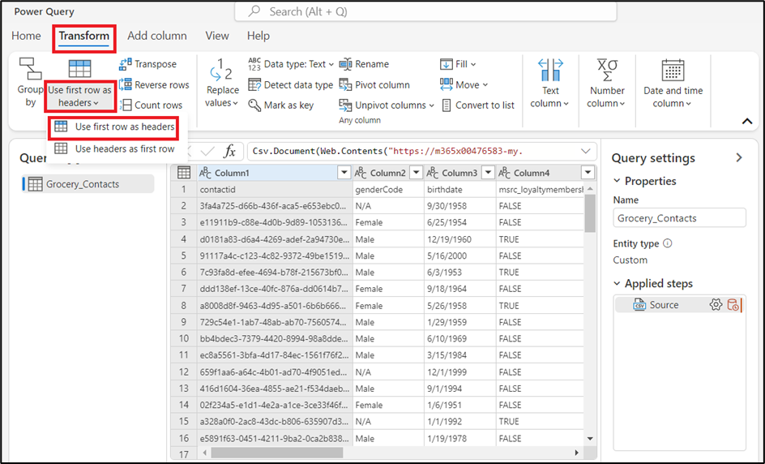

13. Fare clic con il pulsante destro del mouse sulla colonna
    **birthdate**, passare a **Change type** e quindi selezionare
    **Date**.

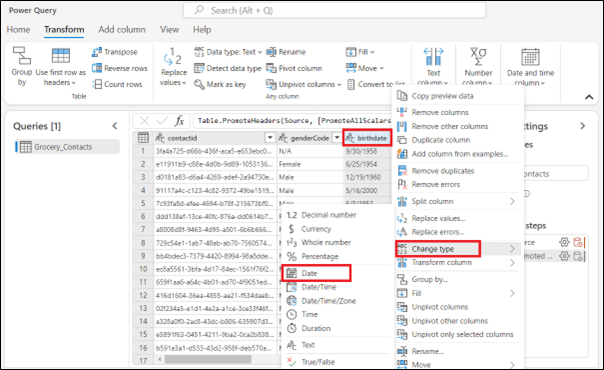

14. Seleziona le seguenti colonne tenendo premuto il tasto **Ctrl**
    sulla tastiera:
    **annualincome**, **msrc_creditscore**, **msrc_customerrelationshipduration**,
    and **msrc_distancetoneareststore**.

15. Quando queste colonne sono evidenziate, fai clic con il pulsante
    destro del mouse su una di esse, vai su **Change type**, quindi
    seleziona **Decimal number**.

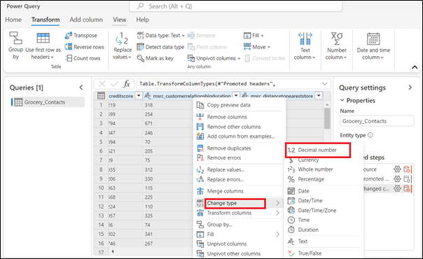

16. In **Properties** sul lato destro, cambia il **Name** in
    [**contact**](urn:gd:lg:a:send-vm-keys) e quindi premi il tasto
    **Enter** sulla tastiera.

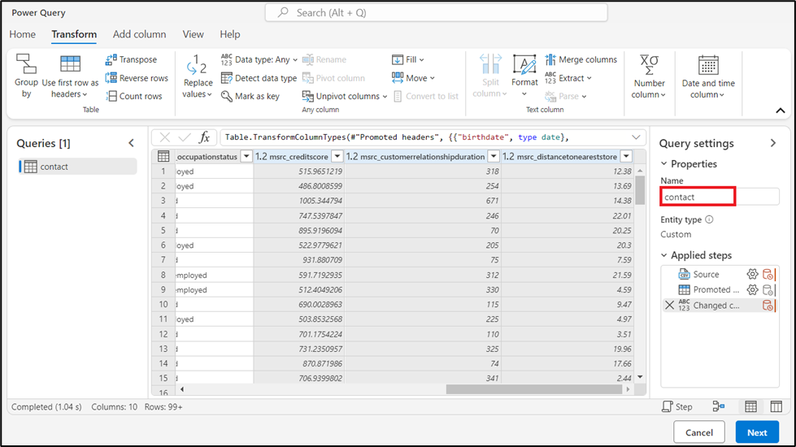

17. Seleziona **Next**.

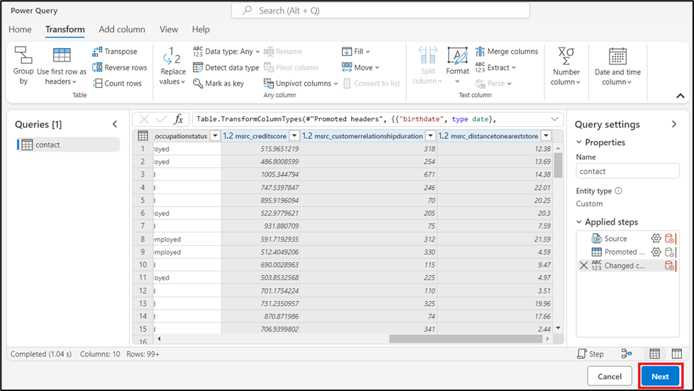

18. Nella pagina **Refresh settings,** selezionare **Refresh manually**.
    Seleziona **Save**.

19. Attendi che l'origine data venga aggiunta correttamente.

20. Nella pagina **Data sources,** selezionare **Add a data source**.

21. Selezionare **Microsoft Power Query**.

22. Entrare [**Grocery Transactions**](urn:gd:lg:a:send-vm-keys) Nel
    **Data source Name** per l'origine data e selezionare **Next**.

23. Nella pagina **Choose data source** selezionare **Text/CSV**.

24. Nella pagina **Connection settings** selezionare **Upload file** e
    quindi selezionare **Browse**.

25. Selezionare **Grocery_transaction.csv** da **C:\LabFiles** nella
    **VM** del lab. Fare clic su **Open**.

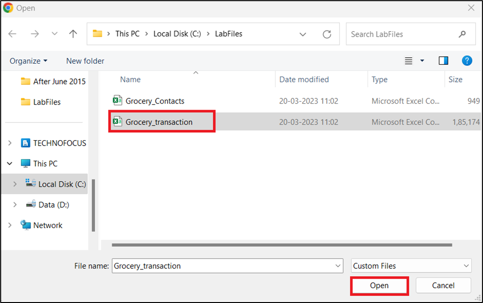

26. Una volta caricato il file, selezionare **Next**.

27. Nella pagina **Preview file data** selezionare **Transform data**.

28. Come prima, vai su **Transform** e seleziona **Use first row as
    headers \> Use first row as headers**.

29. Scorrere fino a e selezionare la colonna
    **msrc_transactiontimestamp**. Fare clic con il pulsante destro del
    mouse sulla colonna, scegliere **Change Type** e quindi selezionare
    **Date/Time**.

30. Tieni premuto il tasto **Ctrl** sulla tastiera per selezionare le
    colonne **msrc_transactionamount** e **msrc_discountappliedamount**.
    Fare clic con il pulsante destro del mouse su una delle colonne,
    andare su **Change Type**, quindi selezionare **Decimal number**.

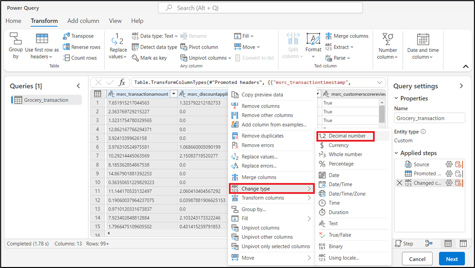

31. Seleziona **Next**.

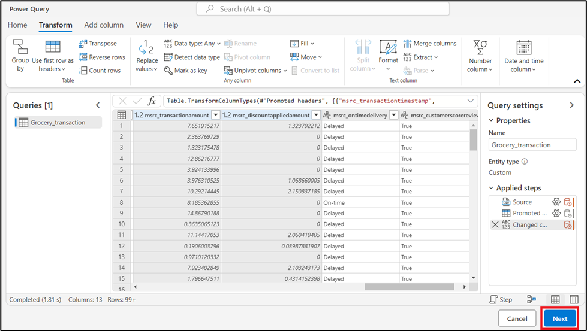

32. Nella pagina **Refresh settings,** selezionare **Refresh manually**.
    Seleziona **Save**.

33. Attendi che l'origine data venga aggiunta correttamente.

# Esercizio 2: Unificare i data

1.  In **Customer Insights - Data**, espandi **Data** nel riquadro di
    navigazione a sinistra, quindi seleziona **Unify**.

2.  Seleziona **Get started** nell'area **Customer data.**

3.  Nella pagina **Describe the customer data to be unified**
    selezionare il pulsante **Select Tables and Columns**.

4.  Seleziona le tabelle dei **contact** e **Grocery_transaction**,
    quindi seleziona **Apply**.

5.  Selezionare la tabella dei **contact**, quindi selezionare
    **contactid** come chiave primaria.

6.  Selezionare la tabella **Grocery_transaction**, quindi selezionare
    **msrc_transactionid** come chiave primaria. Seleziona **Next**.

7.  Nella pagina **Define deduplication rules**, fare clic su **Next**.

8.  Nella pagina **Define matching rules**, imposta le tabelle nel
    seguente ordine: **contact** e **Grocery_transaction**.

9.  Assicurarsi che la casella di controllo **Include all records** sia
    selezionata per tutte le tabelle.

10. Seleziona **+ Add rule** accanto alla tabella
    **Grocery_transaction**.

11. Selezionare **contactid** e **msrc_customerid,** e quindi assegnare
    un nome alla regola
    [**contacttransactions**](urn:gd:lg:a:send-vm-keys). Selezionare
    **Done**.

12. Seleziona **Next**.

13. Esaminare e modificare il modo in cui i data di origine vengono
    combinati nei campi unificati del cliente nella pagina **Unified
    data view**. Fare clic su **Next**.

14. Nella pagina **Review and create customer profiles**, seleziona
    **Create customer profiles.**

15. Il completamento di questo processo richiederà alcuni minuti.

16. Esamina i campi **Customer data**, **Deduplication
    rules**, **Matching rules**, e **Unified data view** nella pagina
    **Unify**.

## Esercizio 3: Creare segmenti con Copilot for Customer Insights - Data (anteprima)

1.  In **Customer Insights - Data**, vai a **Insights** \> **Segments**
    e seleziona + **New segment** per creare un segmento.

2.  Selezionare l'icona Copilot per aprire il riquadro **Copilot**.

3.  Inserisci una descrizione del segmento o scegli uno dei prompt
    suggeriti. Ad esempio, selezionare **Customers who have a loyalty
    membership. **.

4.  Selezionare **Use** per applicare il risultato a una regola.

5.  Seleziona **Run**.

6.  Nella pagina **Review details** immettere **Loyalty membership** nel
    campo **Name** e quindi selezionare **Run**.

7.  Il segmento **Loyalty membership** è stato creato.

**Nota**: se il segmento risultante contiene più [***relationship
paths***](https://learn.microsoft.com/en-us/dynamics365/customer-insights/data/relationships),
per impostazione predefinita utilizza il percorso più breve. **Edit** il
segmento per cambiare il percorso della relazione.
