# Lab 11: Creating segments with Copilot for Customer Insights - Data (preview)

## Exercise 1: Add your Data

1.  Access your **Customer Insights - Data** environment using the given
    link [**https://home.ci.ai.dynamics.com/**](urn:gd:lg:a:send-vm-keys).
    From the left navigation, select **Data** \> **Data sources**.

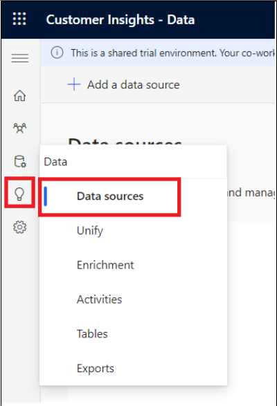

Note: Close the pop up – introducing Copilot in Customer Insights –
Data.

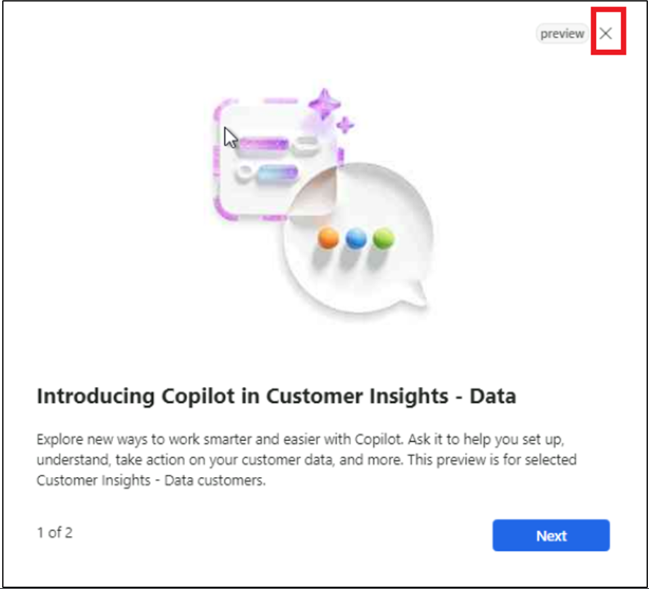

2.  Select **Add a data source**.

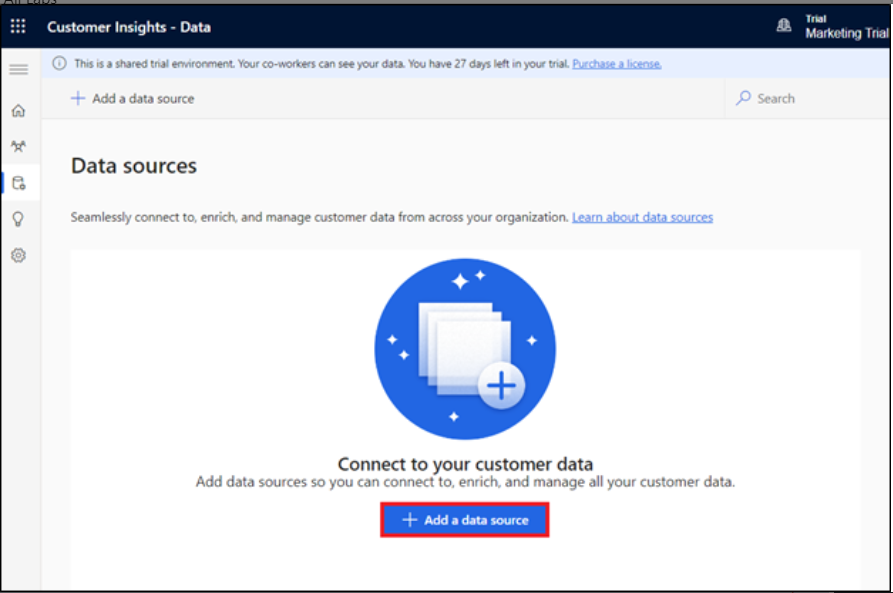

3.  Select **Microsoft Power Query**.

4.  Enter **GroceryContacts** in the **Data source** **Name** for the
    data source and select **Next**.

5.  On the **Choose data source** page select **Text/CSV**.

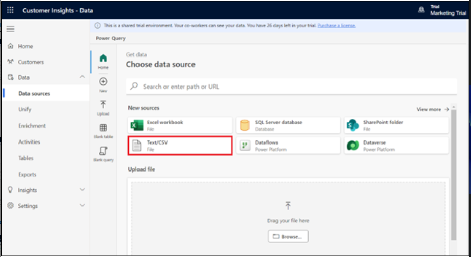

6.  On the **Connection settings** page, select **Upload file** and then
    select **Browse**.

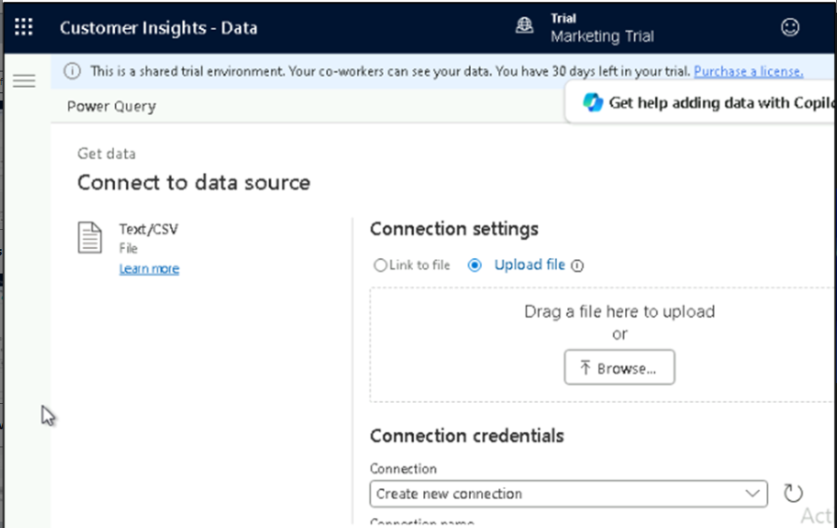

7.  Select **Grocery_Contacts.csv** from **C:\LabFiles** in your
    lab **VM**. Select **Open**.

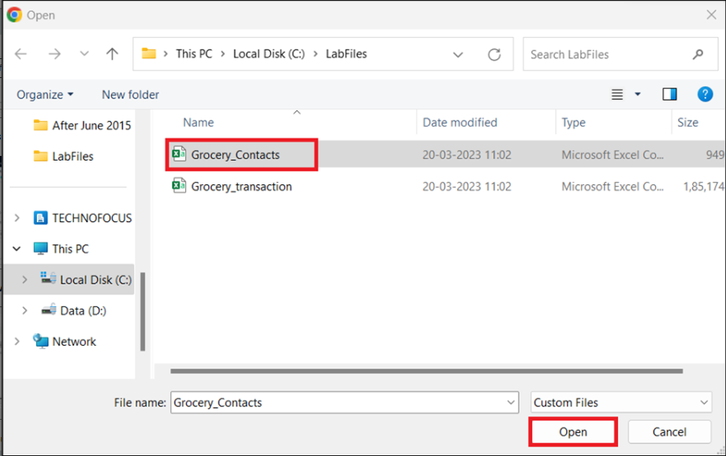

8.  Select **Sign in**, to login to your account.

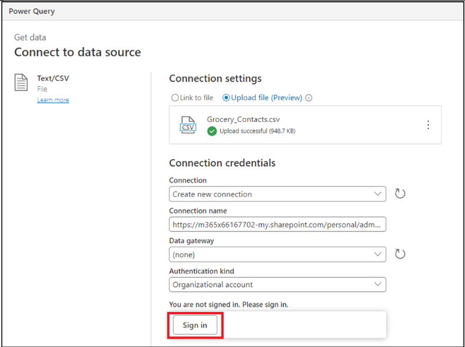

9.  Enter your **Office 365 admin tenant** credentials.

10. Select **Next**.

11. On the **Preview file data** page, select **Transform data**.

12. On the **Transform data** page, go to the **Transform** ribbon and
    then select the **Use first row as headers \> Use first row as
    headers** option.

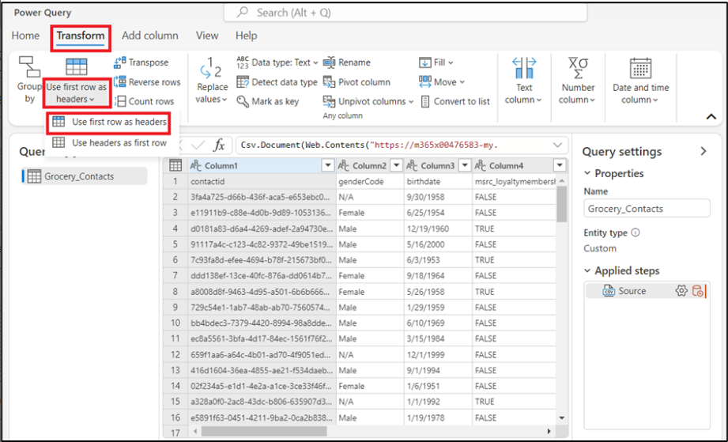

13. Right-click the **birthdate** column, go to **Change type**, and
    then select **Date**.

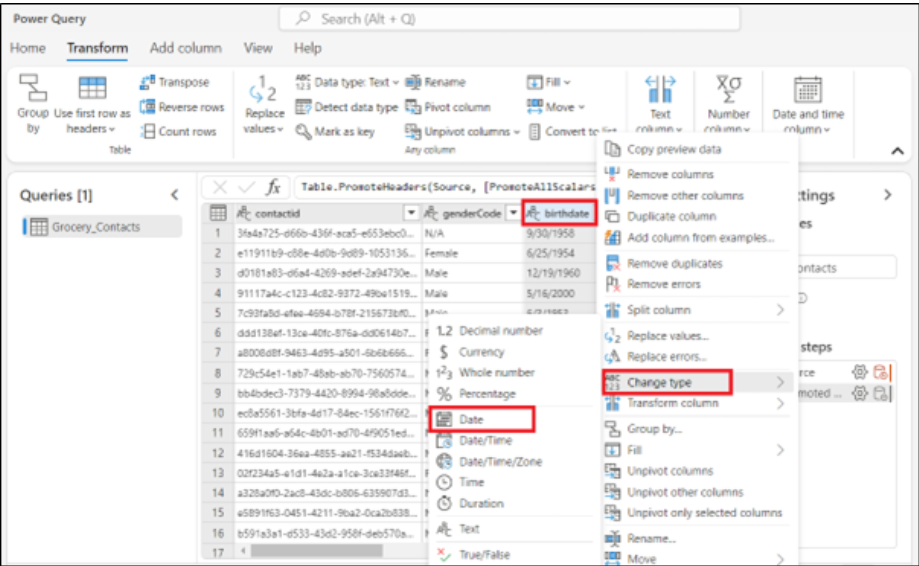

14. Select the following columns by holding down the **Ctrl** key on
    your
    keyboard: **annualincome**, **msrc_creditscore**, **msrc_customerrelationshipduration**,
    and **msrc_distancetoneareststore**.

15. When these columns are highlighted, right-click one of them, go
    to **Change type**, and then select **Decimal number**.

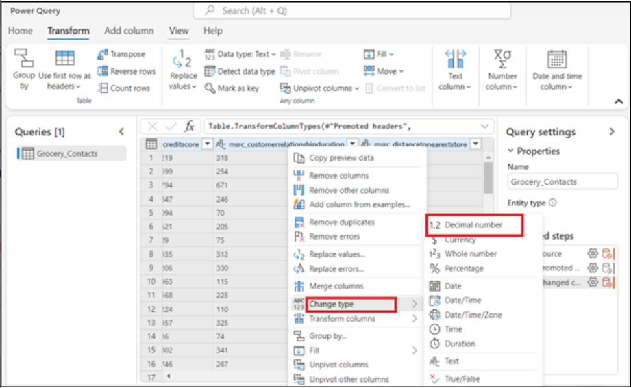

16. Under **Properties** on the right side, change
    the **Name** to [**contact**](urn:gd:lg:a:send-vm-keys) and then
    press the **Enter** key on your keyboard.

17. Select **Next**.

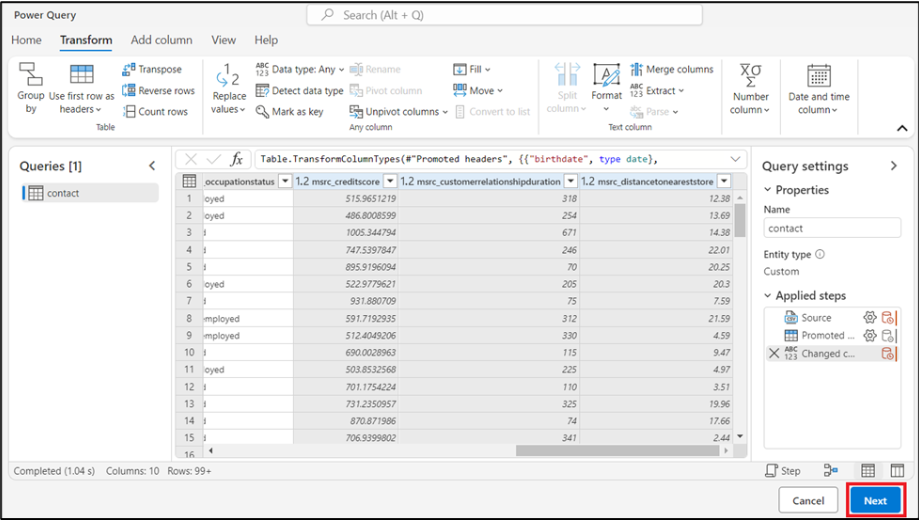

18. On the **Refresh settings** page, select **Refresh manually**.
    Select **Save**.

19. Wait till the Data source is added successfully.

20. On the **Data sources** page, select **Add a data source**.

21. Select **Microsoft Power Query**.

22. Enter [**GroceryTransactions**](urn:gd:lg:a:send-vm-keys) in
    the **Data source Name** for the data source and select **Next**.

23. On the **Choose data source** page select **Text/CSV**.

24. On the **Connection settings** page, select **Upload file** and then
    select **Browse**.

25. Select **Grocery_transaction.csv** from **C:\LabFiles** in your
    lab **VM**. Click **Open**.

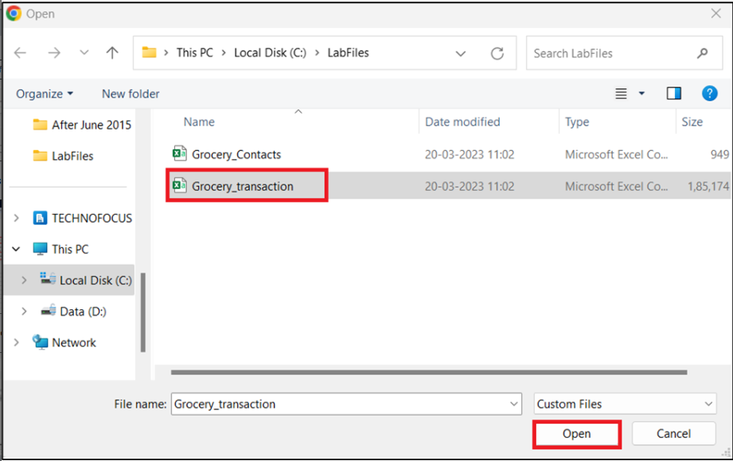

26. Once the file is uploaded, select **Next**.

27. On the **Preview file data** page, select **Transform data**.

28. As before, go to **Transform** and select **Use first row as headers
    \> Use first row as headers**.

29. Scroll to and select the **msrc_transactiontimestamp** column.
    Right-click the column, select **Change type**, and then
    select **Date/Time**.

30. Press and hold the **Ctrl** key on your keyboard to select
    the **msrc_transactionamount** and **msrc_discountappliedamount** columns.
    Right-click one of the columns, go to **Change type**, and then
    select **Decimal number**.

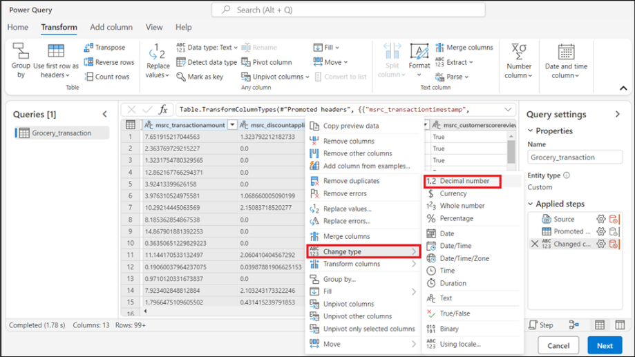

31. Select **Next**.

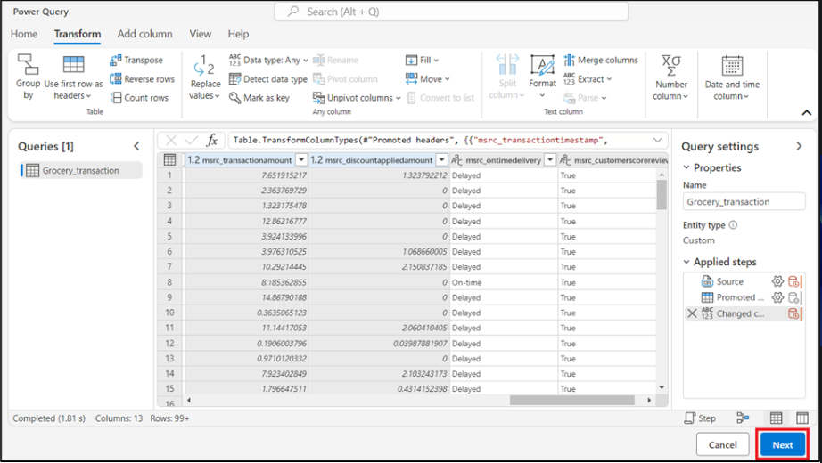

32. On the **Refresh settings** page, select **Refresh manually**.
    Select **Save**.

33. Wait till the Data source is added successfully.

# Exercise 2: Unify your data

1.  In **Customer Insights - Data**, expand **Data** in the left
    navigation pane and then select **Unify**.

2.  Select **Get started** on the **Customer data** area.

3.  On the **Describe the customer data to be unified** page, select
    the **Select tables and columns** button.

4.  Select **contact** and **Grocery_transaction** tables and then
    select **Apply**.

5.  Select the **contact** table and then select **contactid** as the
    primary key.

6.  Select the **Grocery_transaction** table and then
    select **msrc_transactionid** as the primary key. Select **Next**.

7.  On the **Define deduplication rules** page, click **Next**.

8.  On the **Define matching rules** page, set up the tables in the
    following order: **contact** and **Grocery_transaction**.

9.  Ensure that the **Include all records** checkbox is selected for all
    tables.

10. Select **+ Add rule** next to the **Grocery_transaction** table.

11. Select **contactid** and **msrc_customerid**, and then name the
    rule [**contacttransactions**](urn:gd:lg:a:send-vm-keys).
    Select **Done**.

12. Select **Next**.

13. Review and edit how source data is combined into unified customer
    fields on the **Unified data view** page. Click **Next**.

14. On the **Review and create customer profiles** page, select **Create
    customer profiles**.

15. This process will take several minutes to complete.

16. Review the **Customer data**, **Deduplication rules**, **Matching
    rules**, and **Unified data view** fields on the **Unify** page.

## Exercise 3: Create segments with Copilot for Customer Insights - Data (preview)

1.  In **Customer Insights - Data**, go
    to **Insights** \> **Segments** and select + **New segment** to
    create a segment.

2.  Select the Copilot icon to open the **Copilot** pane.

3.  Enter a description of your segment or choose one of the suggested
    prompts. For example, select **Customers who have a loyalty
    membership**.

4.  Select **Use** to apply the result to a rule.

5.  Select **Run**.

6.  On the **Review details** page, enter **Loyalty membership** in
    the **Name** field and then select **Run**.

7.  The **Loyalty membership** segment is now created.

**Note**: If the resulting segment contains multiple [***relationship
paths***](https://learn.microsoft.com/en-us/dynamics365/customer-insights/data/relationships),
it uses the shortest path by default. **Edit** the segment to change the
relationship path.
