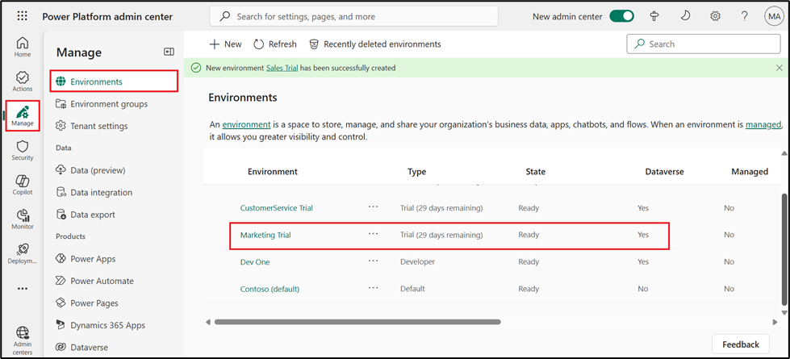
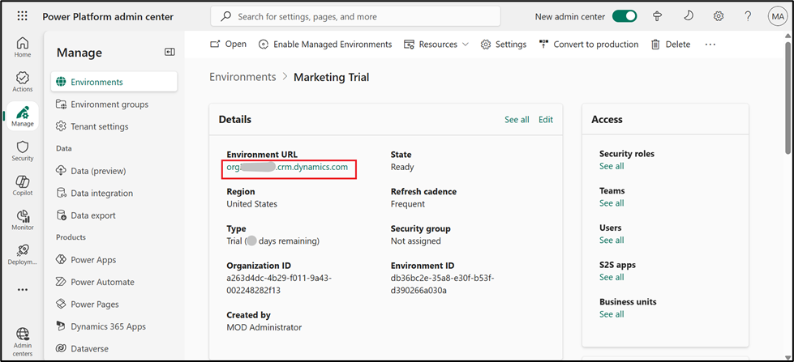
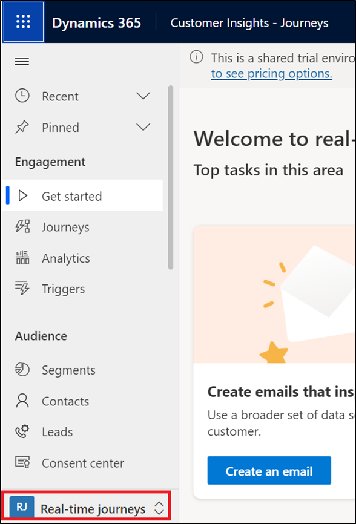

# 实验 12：在 Customer Insights 中使用 Copilot 通过 AI 辅助主题设计和设置电子邮件样式 - 旅程

## 练习 1：启用 Copilot 

1.  导航到 [**https://admin.powerplatform.microsoft.com**](urn:gd:lg:a:send-vm-keys) 转到
    **Power Platform admin center**，如果需要，使用给定的 **Office 365
    管理员租户**凭据登录。

2.  从左侧导航窗格中，选择 **Environment**，然后单击 **Marketing
    Trial**。

3.  单击 **Environment URL**（环境 URL）。

4.  选择 **Real-time Journeys**。

5.  转到 更改区域，选择 **Settings**。从左侧导航窗格中，选择
    **Settings** （设置）。在 “**Overview**” 下，选择 “**Feature
    switches**” 。

6.  向下滚动并在 Copilot 部分下，启用 **Global Opt-in consent**
    切换和**Global data sharing consent** 切换。选择右上角的 **Save**
    （保存）。

## 任务 2：使用 Copilot 生成内容创意

1.  从 Change area 中选择 **Real-time journeys**。

2.  在左侧导航窗格中，选择 Channels （渠道） 下的 **Emails**
    （电子邮件）。

3.  选择 **+New**。

4.  选择 **Skip** on Email template 弹出窗口。

5.  在电子邮件编辑器工具箱中选择 **Content Ideas** 图标（第 3 个图标）。

6.  如果您的电子邮件不是空的（包含至少 10 个单词），则 copilot
    将根据您的电子邮件内容自动填写推荐的关**键点**以产生新的想法。然后，您可以根据需要优化它们。

7.  如果您的电子邮件为空（或包含少于 10
    个单词），请从建议的主题列表中选择 **Topic of your email**
    。例如，选择 **Event Invitation**（活动邀请）。

8.  如果您选择其中一个建议的主题，Copilot
    会自动为您填写示例关键点，您可以根据需要对其进行修改。

**注意：**如果您选择自定义主题，请最多添加 5
个您希望在电子邮件中传达的关键点（建议每个关键点至少三个字）。您还可以使用预制示例（选择
**See examples** 链接，然后选择 **Use this example** for a selected set
of key points）。

9.  选择 **Tone of voice - Engaged**（语气 - 参与）。

10. 选择 **Get ideas**。

11. Copilot 会生成一组文本建议。生成内容可能需要一小段时间（最多 15
    秒，具体取决于使用情况）。

12. 将鼠标悬停在生成的内容上，选择 **+Add to my draft** ，然后选择 **+
    Add element here** 在电子邮件正文中。

13. 使用 **Content ideas** 窗格中的滚动条浏览生成的想法。

14. 您可以选择 **Get more ideas** 为相同的关键点生成更多想法。

## 任务 3：使用主题 Copilot 助手

1.  选择 **Theme** 从 Email editor 工具箱。

2.  在主题助手部分中输入网站 URL，然后选择 **Fetch
    styles**。此过程可能需要几分钟时间。

**注意：**您可以在此处使用您的 Power Pages 网站 URL。

3.  一旦主题助手从您的网站获取样式，它就会将该样式应用于您的电子邮件主题。您可以在电子邮件编辑器中查看更改。选择
    **Keep and close** （保留并关闭）。

4.  如果您对结果满意，您可以**保存**您的电子邮件主题。如果要进行进一步调整，可以使用主题窗格编辑电子邮件元素的样式。

5.  双击 Email body 区域中的 **Company address**。单击 Compliance 下的
    Company address。

6.  在 Brand profile 下选择 **Facebook URL**。

7.  选择 **Save** （保存）。

8.  展开电子邮件的第一部分。输入以下信息，然后选择 **Save** （保存）。

**发件人：**搜索并选择 Default Brand sender

**主题：** Test mail

9.  选择 **Preview and test**（预览并测试）。

10. 选择 more 选项（三个点），然后选择 **Test send**。

11. 输入您的电子邮件 ID，然后选择 **Test send**。

12. 选择 **Ready to send**。

