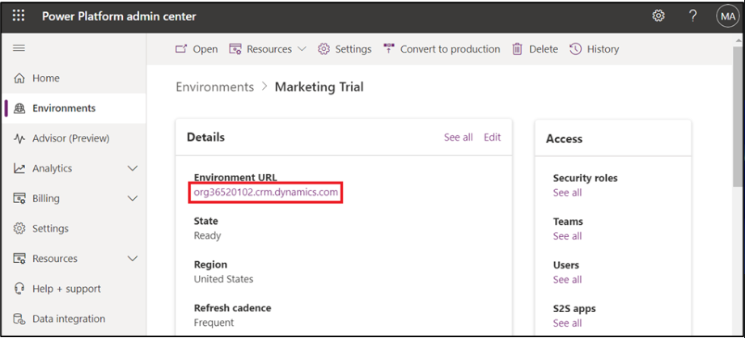
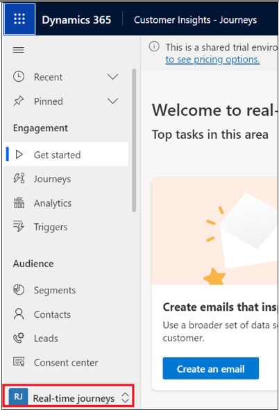

# Atelier 12 : Conception et stylisation d'e-mails avec des thèmes assistés par l'IA à l'aide de Copilot in Customer Insights - Journeys

## Exercice 1 : Activer Copilot

1.  Accédez au **Power Platform admin center**  en accédant à
    [**https://admin.powerplatform.microsoft.com**](urn:gd:lg:a:send-vm-keys)
    et, si nécessaire, connectez-vous à l'aide des informations
    d'identification du locataire **Office 365 admin tenant**  que vous
    avez fournies.

2.  Dans le volet de navigation de gauche, sélectionnez
    **Environnement**, puis cliquez sur **Marketing Trial**.

3.  Cliquez sur **environnement URL**.

4.  Sélectionnez **Real-time Journeys**.

5.  Allez dans Modifier la zone, sélectionnez **Settings.** Dans le
    volet de navigation de gauche, sélectionnez **Settings**. Sous
    **Overview,** sélectionnez **Commutateurs de Feature switches**.

6.  Faites défiler vers le bas et sous la section **Copilote**, activez
    le **Global Opt-in consent**  global et **Global data sharing
    consent**  Sélectionnez **Save** dans le coin supérieur droit.

## Tâche 2 : Générer des idées de contenu à l'aide de Copilot

1.  Sélectionnez **Real-time journeys**  dans la zone Modifier.

2.  Dans le volet de navigation de gauche, sélectionnez **Emails** sous
    Canaux.

3.  Sélectionnez **+New**.

4.  Sélectionnez **Skip**  la fenêtre contextuelle du modèle d'e-mail.

5.  Sélectionnez l'icône **Content Ideas**  (3e icône) dans la boîte à
    outils de l'éditeur d'e-mails.

6.  Si votre email n'est pas vide (contient au moins 10 mots), le
    copilot, en fonction du contenu de votre email, remplira
    automatiquement les **key points**  recommandés pour générer de
    nouvelles idées. Vous pourrez ensuite les affiner en fonction de vos
    besoins.

7.  Si votre e-mail est vide (ou contient moins de 10 mots), choisissez
    le **Topic of your email**  dans la liste des sujets suggérés. Par
    exemple, sélectionnez **Event Invitation**.

8.  Si vous sélectionnez l'un des sujets suggérés, Copilot remplit
    automatiquement des exemples de points clés pour vous, que vous
    pouvez modifier en fonction de vos besoins.

**Remarque :** Si vous sélectionnez un sujet personnalisé, ajoutez
jusqu'à cinq points clés que vous souhaitez transmettre dans votre
e-mail (un minimum de trois mots par point clé est recommandé). Vous
pouvez également utiliser des exemples prédéfinis (sélectionnez le
**lien Voir les exemples**, puis **See examples** pour un ensemble
sélectionné de points clés).

9.  Sélectionnez le **Tone of voice - Engaged**.

10. Sélectionnez **Get ideas**.

11. Copilot génère un ensemble de suggestions de texte. La génération de
    contenu peut prendre un court moment (jusqu'à 15 secondes, selon
    l'utilisation).

12. Passez la souris sur le contenu généré, sélectionnez **+Add to my
    draft**  puis sélectionnez **+ Add element here**  dans le corps de
    l'e-mail.

13. Parcourez les idées générées à l'aide de la barre de défilement du
    volet **Content ideas** 

14. Vous pouvez sélectionner **Get more ideas**  d'idées pour générer
    plus d'idées pour les mêmes points clés.

## Tâche 3 : Utilisation du thème Copilot assistant

1.  Sélectionnez **Theme**  dans la boîte à outils de l'éditeur
    d'e-mails.

2.  Entrez l'URL du site Web dans la section de l'assistant de thème et
    sélectionnez **Fetch styles** Ce processus peut prendre quelques
    minutes.

**Remarque :** Vous pouvez utiliser l'URL de votre site Web Power Pages
ici.

3.  Une fois que l'assistant de thème récupère le style de votre site
    Web, il l'applique à votre thème d'e-mail. Vous pouvez voir les
    modifications dans l'éditeur d'e-mails. Sélectionnez **Keep and
    close**.

4.  Si vous êtes satisfait du résultat, vous pouvez **Save** le thème de
    votre e-mail. Si vous souhaitez effectuer d'autres ajustements, vous
    pouvez modifier le style de vos éléments d'e-mail à l'aide du volet
    thématique.

5.  Double-cliquez sur on **Company address**  dans la zone Corps de
    l'e-mail. Cliquez sur Adresse de l'entreprise sous Conformité.

6.  Sélectionnez **Facebook URL**  sous Profil de la marque.

7.  Sélectionnez **Save**.

8.  Développez la première section de l'e-mail. Entrez les informations
    suivantes, puis sélectionnez **Save**.

**Sender**:: recherchez et sélectionnez Expéditeur de la marque par
défaut

**Subject** : Courrier test

9.  Sélectionnez **Preview and test.**

10. Sélectionnez l'option Plus (trois points) et sélectionnez **Test
    send.**

11. Entrez votre adresse e-mail et sélectionnez **Test send.**

12. Sélectionnez **Ready to send**.

