Lab 12: Designing and styling emails with AI-assisted themes using
Copilot in Customer Insights - Journeys

Task 1: Enable Copilot

1.  Go to **Power Platform admin center** by navigating
    to [***https://admin.powerplatform.microsoft.com***](urn:gd:lg:a:send-vm-keys) and
    if required, sign in using your given **Office 365 admin
    tenant** credentials.

2.  From the left navigation pane,
    select **Manage** \> **Environment** and then click on **Marketing
    Trial**.

> 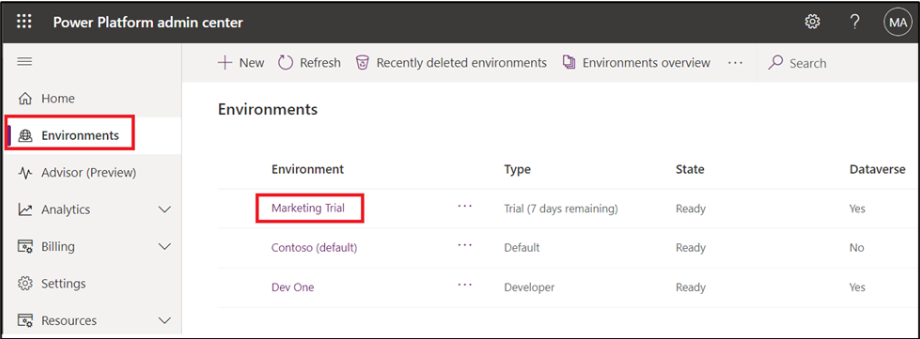

3.  Click on **Environment URL**.

> 

4.  Select **Real-time Journeys**.

> 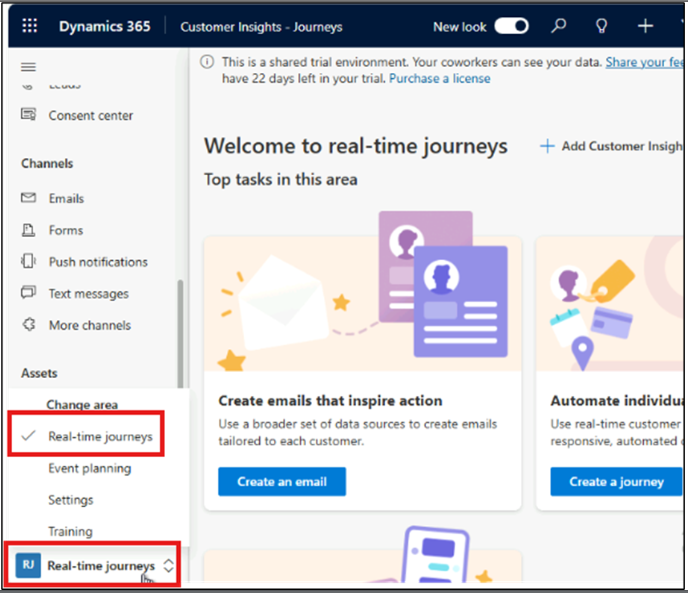

5.  Go to Change area, select **Settings.** From left navigation pane,
    select **Settings**. Under **Overview,** select **Feature
    switches**.

> 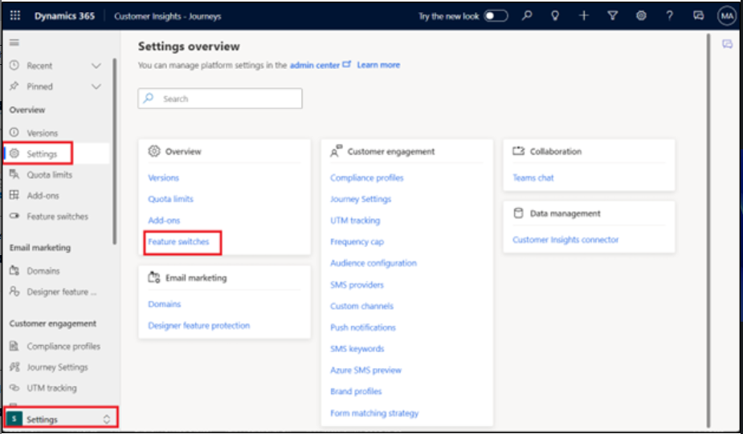

6.  Scroll down and under **Copilot** section, enable the **Global
    Opt-in consent** toggle and **Global data sharing consent** toggle.
    Select **Save** at the top right corner.

> 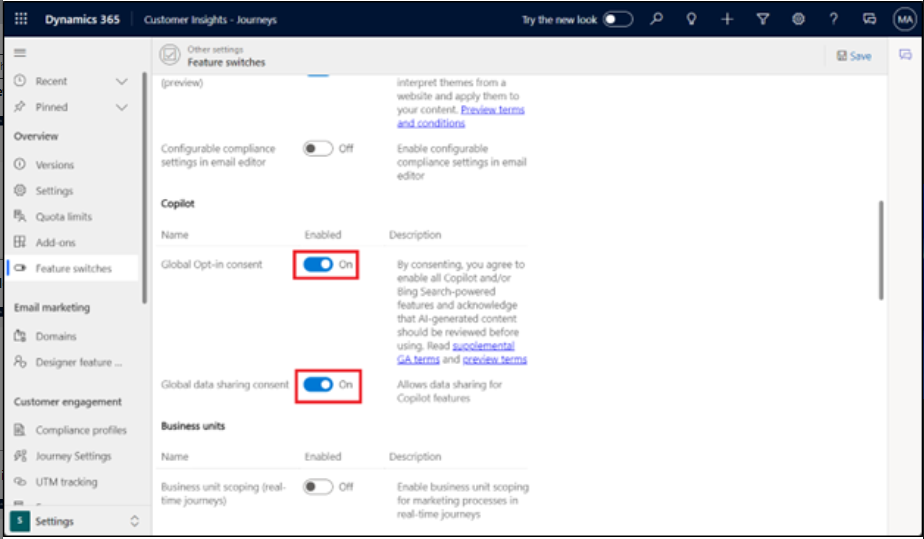

Task 2: Generating content ideas using Copilot

1.  Select **Real-time journeys** from Change area.

> 

2.  From the left navigation pane, select **Emails** under Channels.

> 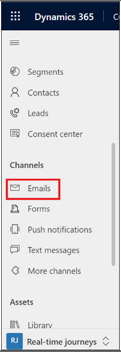

3.  Select **+New**.

> 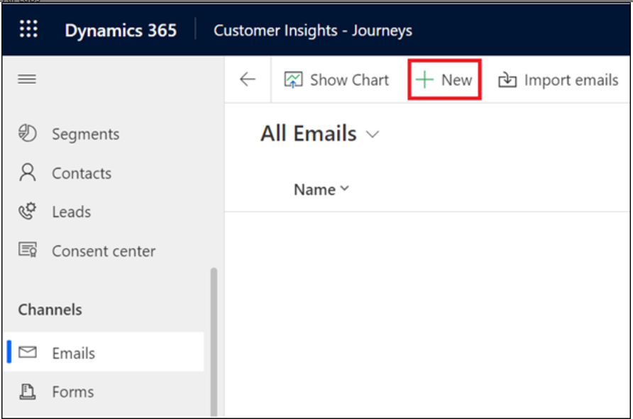

4.  Select **Skip** on Email template pop-up.

> 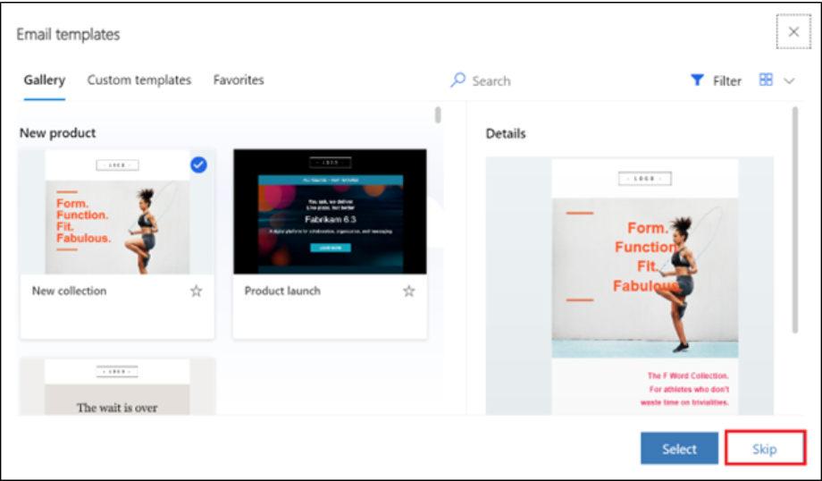

5.  Select **Content Ideas** icon (3rd icon) in the email editor
    toolbox.

> 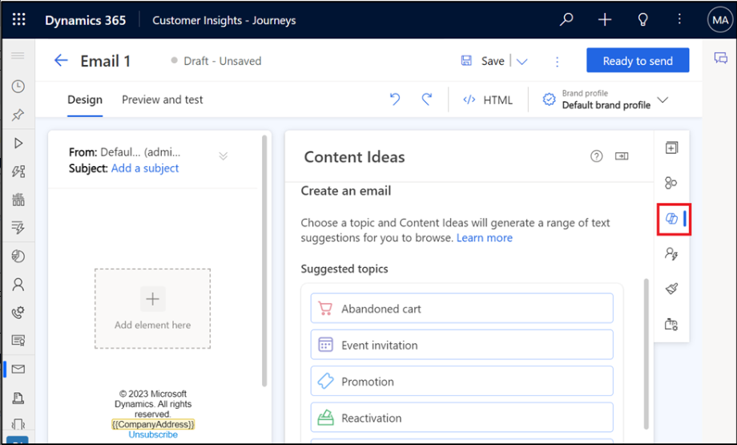

6.  If your email is not empty (contains at least 10 words), the
    copilot, based on your email content, will automatically fill in
    recommended **key points** to generate new ideas. You can then
    refine them according to your needs.

7.  If your email is empty (or contains less than 10 words), choose
    the **Topic of your email** from the list of suggested topics. For
    example select **Event Invitation**.

> 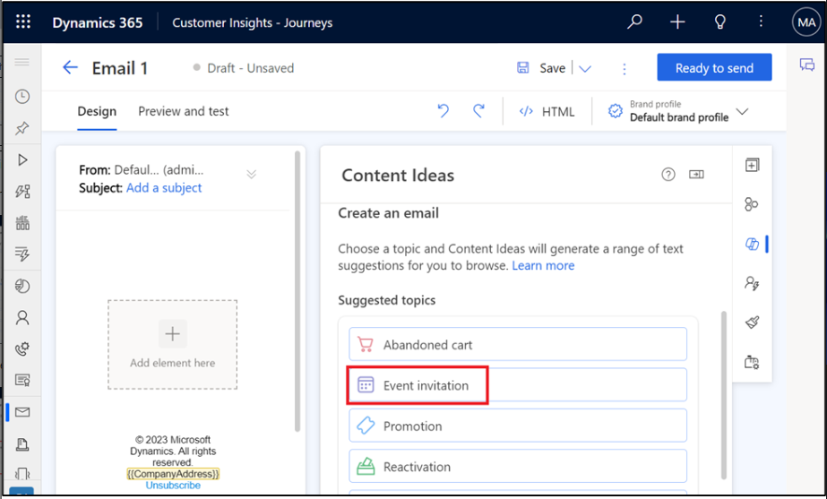

8.  If you select one of the suggested topics, Copilot automatically
    fills in sample key points for you, which you can modify according
    to your needs.

> 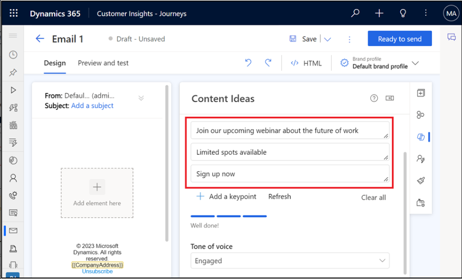
>
> **Note:** If you select a custom topic, add up to five key points that
> you want to get across in your email (a minimum of three words per key
> point is recommended). You can also use premade examples (select
> the **See examples** link and then **Use this example** for a selected
> set of key points).

9.  Select the **Tone of voice - Engaged**.

> 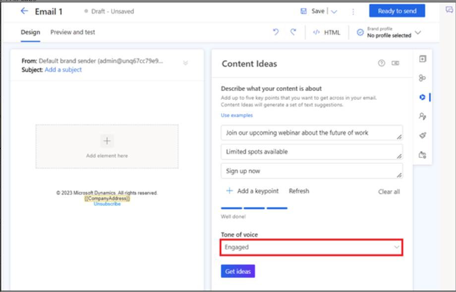

10. Select **Get ideas**.

> 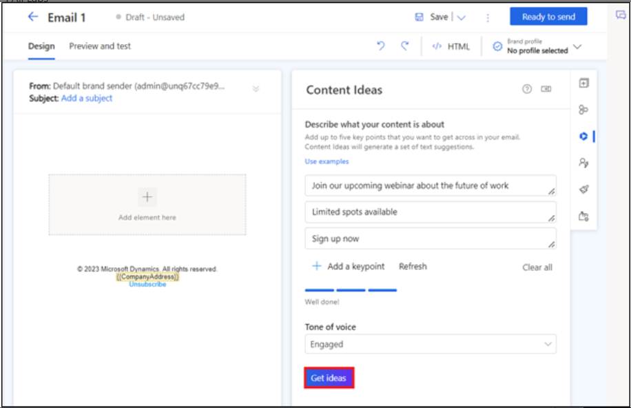

11. Copilot generates a set of text suggestions. It might take a short
    while to generate content (up to 15 seconds, depending on the
    usage).

> 

12. Hover the mouse over the generated content, select **+Add to my
    draft** and then select **+Add element here** in the Email Body.

> 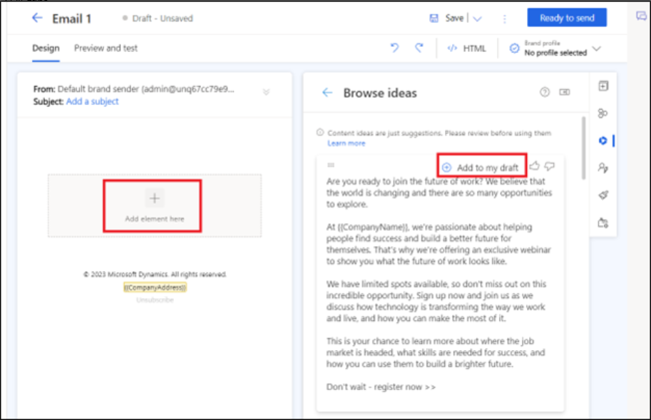

13. Browse the generated ideas using the scrollbar in the **Content
    ideas** pane.

14. You can select **Get more ideas** to generate more ideas for the
    same key points.

> 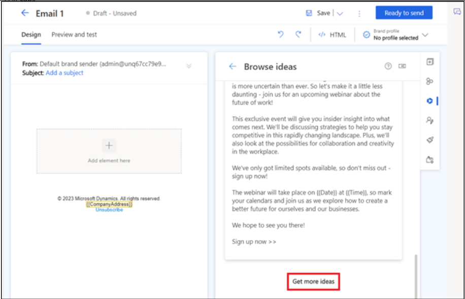

Task 3: Using the theme Copilot assistant

1.  Select **Theme** from the Email editor toolbox.

> 

2.  Enter the website URL in the theme assistant section and
    select **Fetch styles**. This process may take a few minutes.

> **Note:** You can use your Power Pages website url here.
>
> 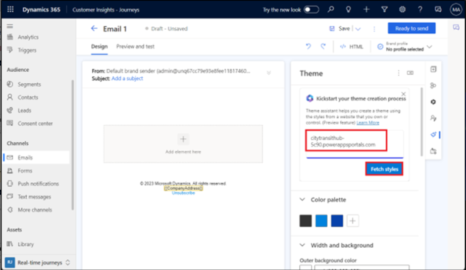

3.  Once the theme assistant fetches the style from your website, it
    applies the style to your email theme. You can see the changes in
    the email editor. Select **Keep and close**.

> 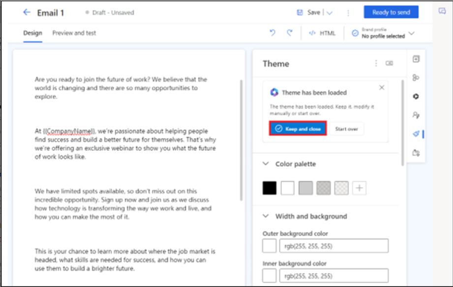

4.  If you're happy with the result, you can **save** your email theme.
    If you want to make further adjustments, you can edit the style of
    your email elements using the theme pane.

> 

5.  Double click on **Company address** in the Email body area. Click on
    Company address under Compliance.

> 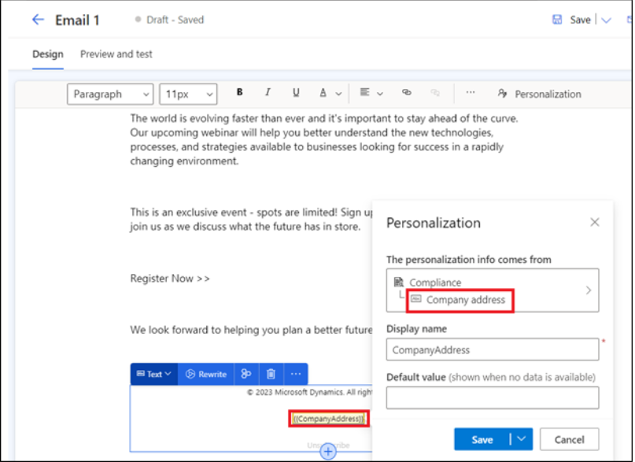

6.  Select **Facebook URL** under Brand profile.

> 

7.  Select **Save**.

> 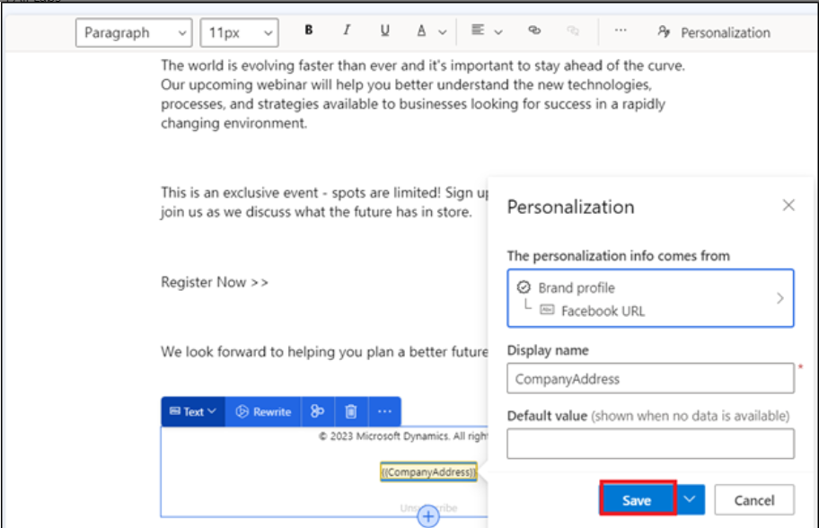

8.  Expand the first section of the email. Enter the following
    information and then select **Save**.

> Sender: Search and select Default Brand sender
>
> Subject: Test mail
>
> 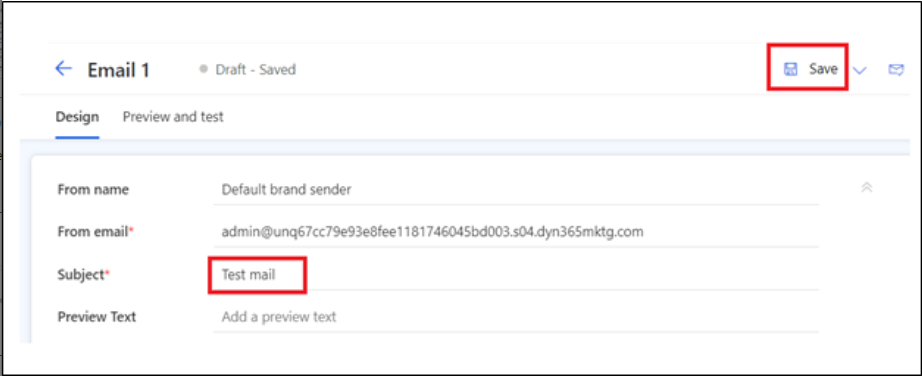

9.  Select **Preview and test**.

> 

10. Select more option (three dots) and select **Test send.**

> 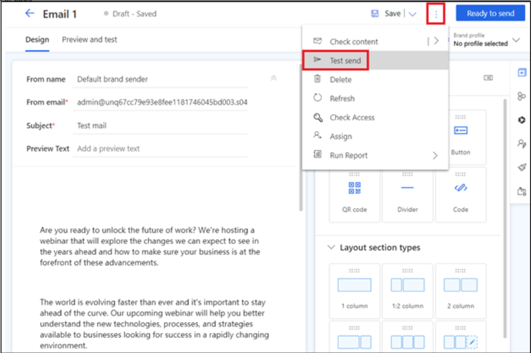

11. Enter your email id and select **Test send.**

> 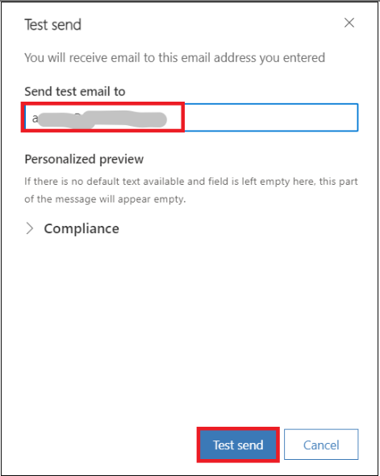

12. Select **Ready to send**.

> 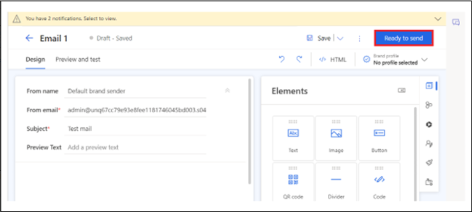
