Lab 13: Creating AI-Assisted customer journey with Copilot in Customer
Insights - Journeys

Exercise 1: Using the journey copilot

Now, let's imagine you want to create a welcome journey for people who
recently joined your program. To create a journey with Copilot,

1.  Navigate to the **Customer Insights - Journeys** portal.

2.  Select the **Journey** tab under **Engagement**.

> 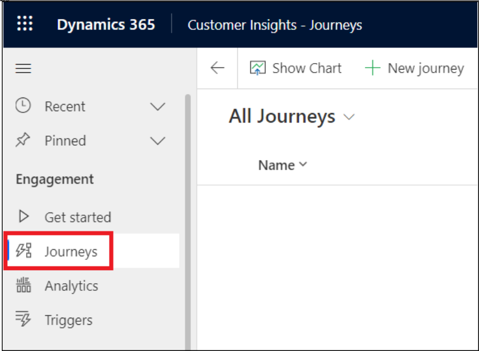

3.  Then select **New Journey**, which opens the journey copilot window.

> 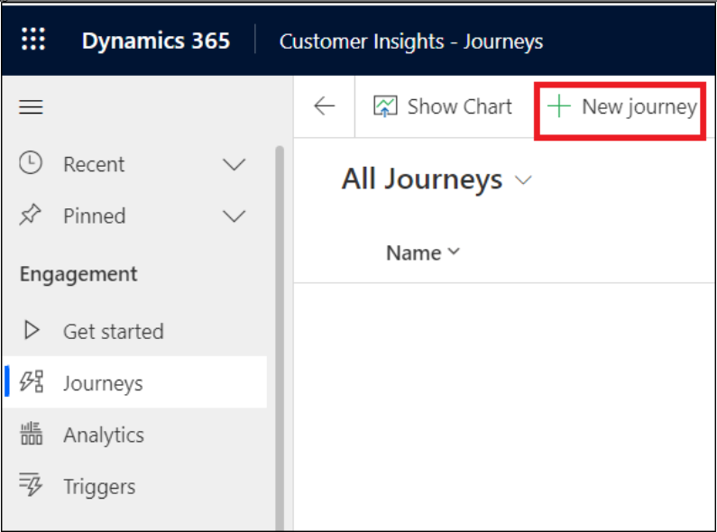

4.  Enter "[***Create a journey that will send a welcome email to all
    customers that are part of the MySegment segment. After two days,
    send them an exclusive offer email.***](urn:gd:lg:a:send-vm-keys)"
    And then select **Send** icon.

> 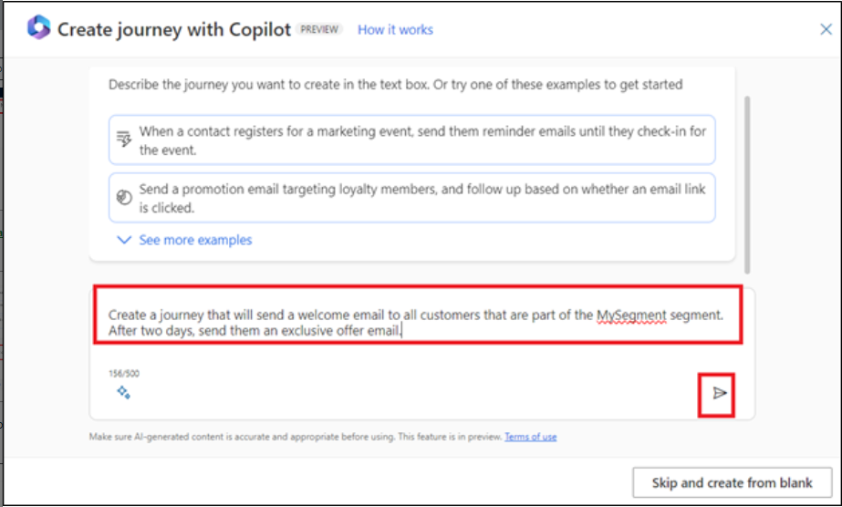

5.  Copilot processes the prompt and asks to select Segment. To create a
    segment, click on the field given to enter the segment name and then
    select **+ New Segment**.

> 

6.  Name the segment as **MySegment** and select **Contact** a target
    audience.

> 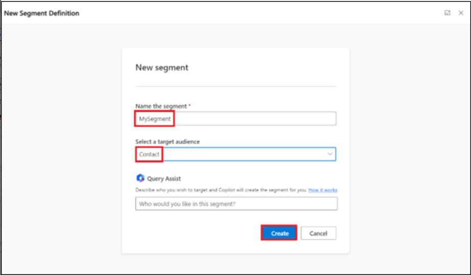

7.  Select **Save**. If this gives you error, ignore it and go to next
    step without saving.

> 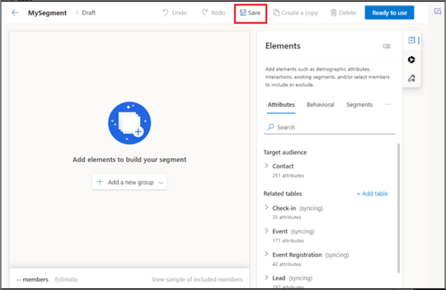

8.  Under Elements pane, select more options ( 3 dots)next to segments
    and then select **Include Contacts.**

> 

9.  click on the **first contact** under the Include member panel and
    you can see the contact is added on the left side under Include
    contacts.

> 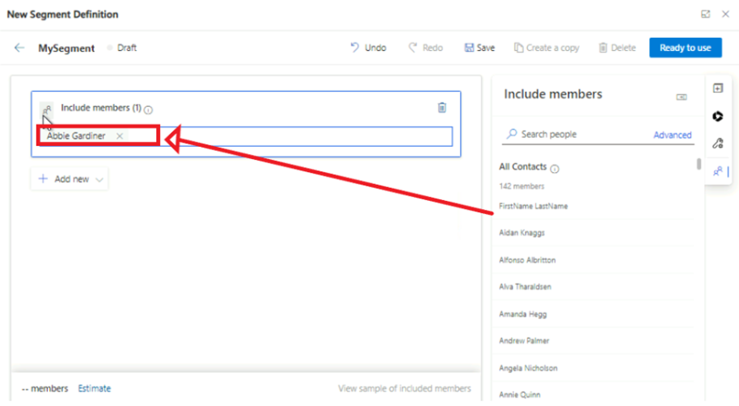

10. Select **Save** and then select **Ready to use**. Close the
    MySegment pane.

> 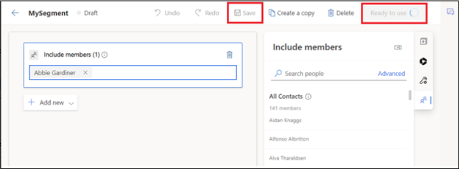

11. Now again execute the New Journey creating step, enter the previous
    prompt. It automatically detected segment and each subsequent step
    clearly.

> 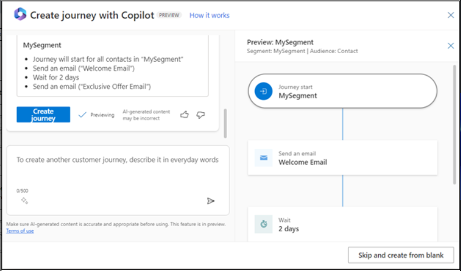

12. Once you're satisfied with the suggested journey, select **Create
    journey** and the journey will be automatically created for you. You
    can use the icon for **thumbs up** and **thumbs down** on the right
    side to provide feedback on the copilot and help it improve over
    time.

> 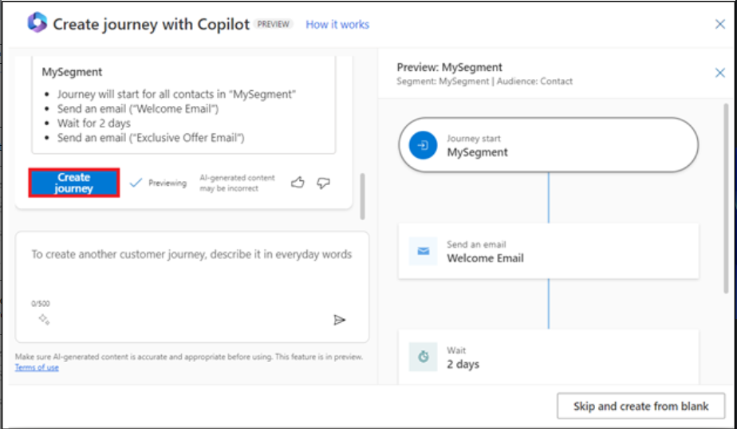

13. Select MySegment step. Select the frequency as **one time journey
    with static audience** and select the **future time** for the start
    time journey.

> 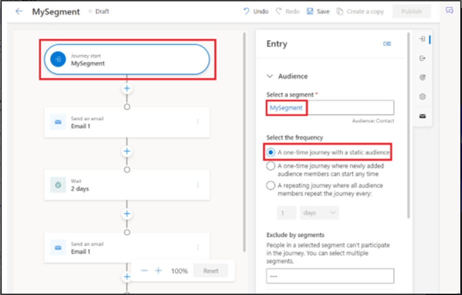

14. Click in the field of **Select email** and then select **+New
    email** and then exeute the following substeps.

> 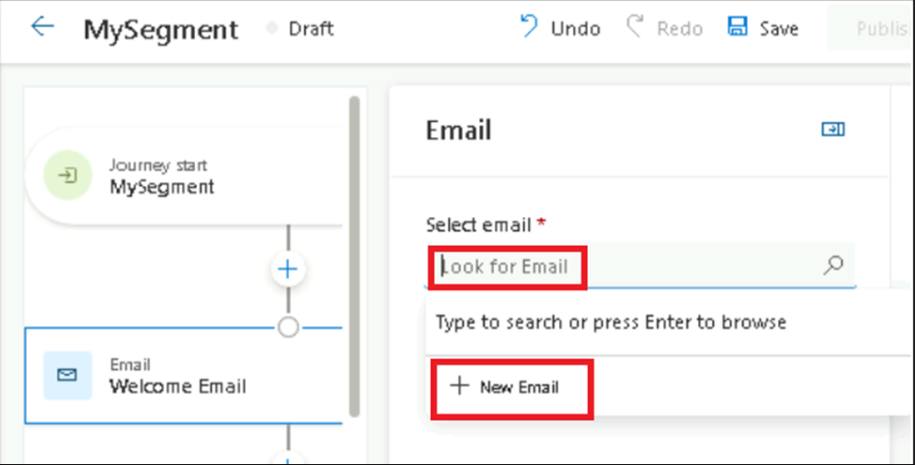
>
> a\. Select **Skip** on Email templates page.
>
> 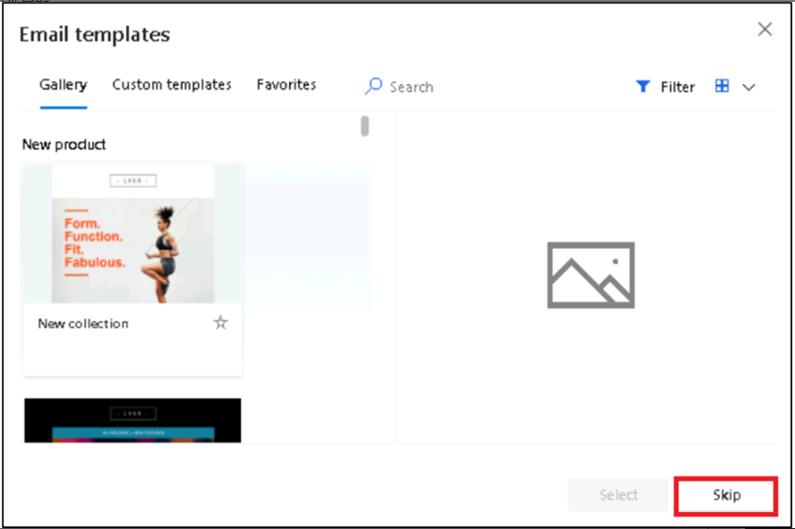
>
> b\. Add subject as [***Testing***](urn:gd:lg:a:send-vm-keys) and then
> select **Save** and then **Ready to send**.
>
> 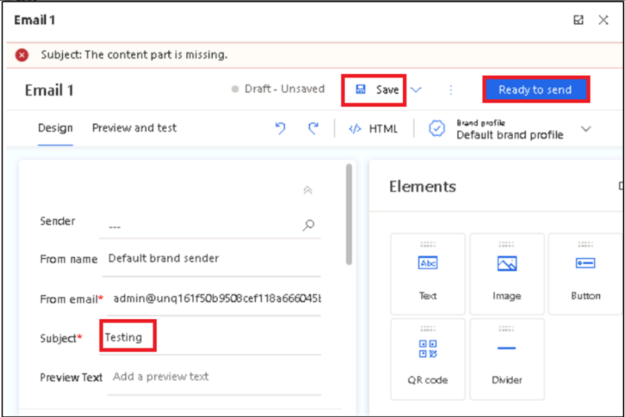
>
> c\. Close the Email panel.
>
> 
>
> d\. You can see that **Email1** is now added to **Select
> email** field. Under the **Send to** field select **Email**.
>
> 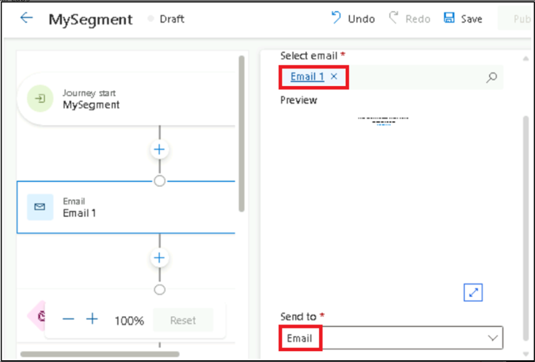

15. Select **Email1** for **Select email** field. Under the **Send
    to** field select **Email**.

> 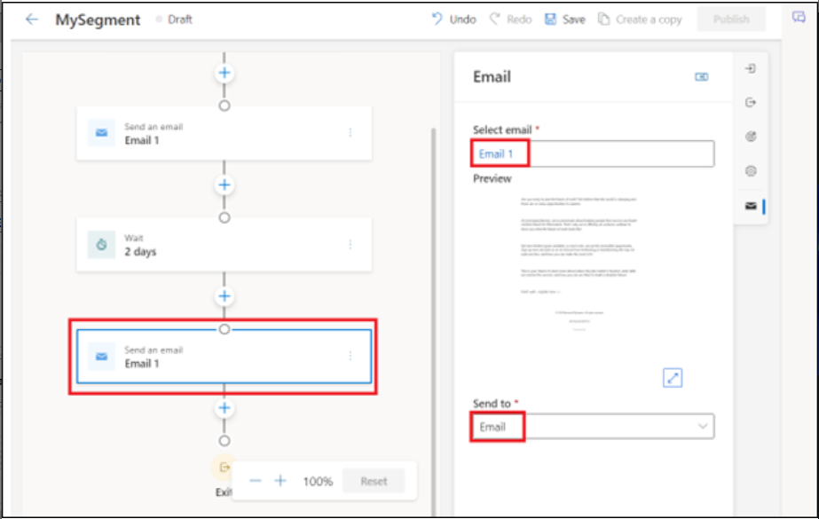

16. Select **Save**.

> 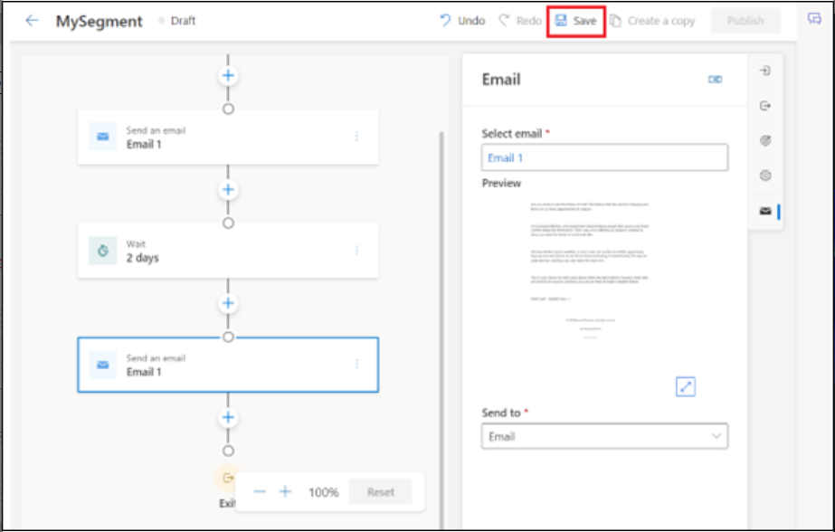

17. Select **Publish**.

> 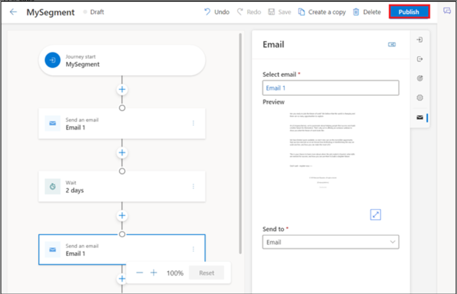
