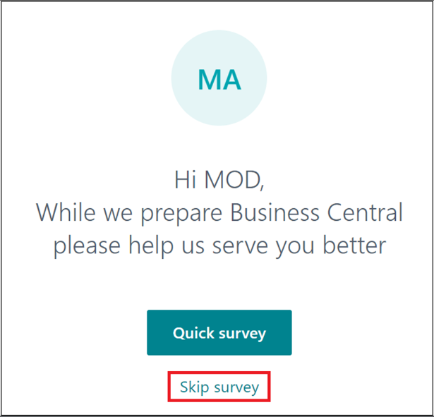

# Laboratório 14: Configurar e usar o Copilot no Dynamics 365 Business Central

## Exercício 1: Cadastrar-se para o teste

1.  Acesse [**https://dynamics.microsoft.com/en-us/dynamics-365-free-trial/**](urn:gd:lg:a:send-vm-keys) selecione
    *Finanças e operações* e, em seguida, no cartão **Dynamics 365
    Business Central**, selecione o botão, **Try for free**.

2.  Insira as credenciais do seu locatário do Office 365 e selecione
    **Next**.

3.  Selecione **Sign in**.

4.  Se solicitado, digite sua senha e selecione **Sign in**.

5.  Selecione **Yes** na janela Stay signed in?

6.  Insira o **Country or region** – **United States**, digite seu
    número de telefone e depois selecione **Get Started**.

7.  Selecione **Skip & go to Dynamics 365 Business Central**.

8.  Selecione **Get Started**.

9.  Selecione **Skip survey**.

10. Você será direcionado para o **Dynamics 365 Business Central home
    page**.

## Exercício 2: Configurando e usando o Copilot e os recursos de AI

### Tarefa 1: Configurando e usando o Copilot e os recursos de AI

1.  No **Business Central**, selecione o **ícone de** **Search** no
    canto superior direito, depois pesquise e abra a página **Copilot &
    AI Capabilities**.

2.  Observe que esta etapa se aplica apenas se a opção **Allow data
    movement** aparecer perto do topo da página **Copilot & AI
    Capabilities**. Ative a opção **Allow data movement**.

3.  A página lista todos os recursos disponíveis relacionados ao Copilot
    e AI e seu status atual, que pode ser ativo ou inativo. Os recursos
    são divididos em duas seções — uma seção para recursos em
    pré-visualização e outra para recursos que estão geralmente
    disponíveis.

Você pode ver o status como 'Ativo', pois o Copilot já está ativado para
os recursos. Se não estiver, para ativar um recurso, selecione-o na
lista e depois selecione a ação **Activate**.

## Tarefa 2: Adicionando texto de marketing aos itens

1.  No Business Central, no canto superior direito, clique no ícone de
    pesquisa, digite Itens e, em seguida, escolha o link relacionado
    para exibir a lista de itens disponíveis.

2.  Clique no primeiro item -- **ATHENS Desk**.

3.  No painel **Marketing Text** na FactBox no lado direito da página,
    selecione **Draft with Copilot**.

4.  O Copilot começa a redigir o texto de marketing.

5.  Quando o Copilot concluí o rascunho, o texto aparece na janela do
    editor do Copilot para você revisar e editar.

### Tarefa 3: Revisar, editar e salvar o texto

Depois de ter o primeiro rascunho, você deve revisá-lo e fazer
alterações no texto para deixá-lo pronto para publicação. Esse trabalho
é feito no editor Copilot, que permite obter mais sugestões, alterar
preferências para influenciar as sugestões e fazer alterações
manualmente e estilizar o texto.

1.  Altere o texto diretamente na caixa de texto. Use a barra de
    ferramentas na parte inferior da caixa para formatar e estilizar o
    texto, adicionar links e muito mais. Por exemplo, selecione o título
    e coloque-o em negrito.

2.  Para obter uma nova sugestão, selecione **Regenerate**.

**Observação:** Se você não estiver satisfeito com as sugestões,
aprimore as sugestões de texto usando as opções de
preferência **Tone**, **Format**, and **Emphasis** preference options.

3.  Revise cuidadosamente o texto quanto à precisão e adequação. Para
    salvar o texto, selecione **Keep it**.

4.  Se você não quiser salvar, selecione o botão descartar (lixeira).

### Tarefa 4: Reconciliar contas bancárias com o Copilot (versão prévia)

1.  Selecione o ícone de Pesquisa que abre o recurso Tell Me, digite
    [Bank Account Reconciliations](urn:gd:lg:a:send-vm-keys)

2.  Selecione e abra uma reconciliação existente na lista.

3.  No cartão **Bank Acc. Reconciliation**, selecione **Reconcile with
    Copilot.**

4.  O **Copilot** começa a gerar correspondências sugeridas.

5.  Quando for concluído, a janela **Reconcile with Copilot** exibirá os
    resultados do processo de correspondência.

6.  O Copilot oferece a oportunidade de inspecionar as propostas e
    salvar ou descartar, conforme sua preferência.

