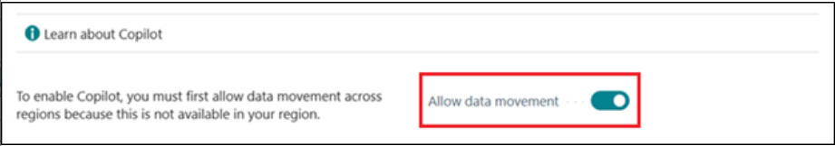

# Laboratorio 14: Configurar y usar Copilot en Dynamics 365 Business Central

## Ejercicio 1: Registrarse para el trial

1.  Vaya
    a [**https://dynamics.microsoft.com/en-us/dynamics-365-free-trial/**](urn:gd:lg:a:send-vm-keys) elija *Finance
    and operations*, y luego, en el **Dynamics 365 Business
    Central** card, elija el botón **Try for free**.

2.  Introduzca sus Office 365 tenant credentials y luego
    seleccione **Next**.

3.  Seleccione **Sign in**.

4.  Si le pide, introduzca su contrasela, y luego seleccione **Sign
    in**.

5.  Seleccione **Yes** en la ventana Stay signed in?.

6.  Introduzca **Country or region** – **United Sates**, introduzca su
    número de teléfono y seleccione **Get Started**.

7.  Seleccione **Skip & go to Dynamics 365 Business Central**.

8.  Seleccione **Get Started**.

9.  Seleccione **Skip survey**.

10. Se le dirigirá al **Dynamics 365 Business Central home page**.

## Ejercicio 2: Configurar y usar el Copilot y las capacidades AI

### **Tarea 1: Configurar y usar Copilot y las capacidades AI** 

1.  En Business Central, seleccione **Search icon** en la esquina
    superior derecha y busque y abra la página **Copilot & AI
    Capabilities**.

2.  Note que este paso solo se aplica en el caso de que el **Allow data
    movement** switch aparece en la parte superior de la
    página **Copilot & AI Capabilities**. Active el **Allow data
    movement** switch.

3.  La página enlista todas las características Copilot y las
    relacionadas con la IA y sus estados actuales (o active o inactive).
    Las características se dividen en dos secciones ---una sección para
    los features en vista previa y otra para los que están generally
    available.

Puede ver el stado como 'Active' ya que Copilot se ha activado para los
features. Si no, para activar un feature, selecciónelo en la lista y
seleccione la acción **Activate**.

## Tarea 2: Agregar marketing text a items

1.  En Business Central, en la esquina superior derecha, haga clic en el
    ícono search, introduzca Items, y elija el enlace relacionado para
    mostrar una lista de items disponibles.

2.  Haga clic en el primer item -- **ATHENS Desk**.

3.  En el panel **Marketing Text** en el FactBox en la parte derecha de
    la página, seleccione **Draft with Copilot**.

4.  Copilot empieza a redactar el texto de marketing.

5.  Cuando Copilot completa el draft, aparece el texto en el Copilot
    editor window para que pueda editar y revisarlo.

### Tarea 3: Revise, edite, y guarde el texto

Una vez que tenga su primer draft, debe revisarlo y hacer cambios al
texto para prepararlo para la publicación. Se hace esto desde Copilot
editor, lo que le permite obtener más sugerencias, cambiar preferencias
para influir las sugerencias, y hacer cambios manualmente y estilar el
texto.

1.  Haga cambios al texto directamente en el text box. Use el tool bar
    debajo del cuadro para formatear y estilizar textos, agregar enlaces
    y mucho más. Por ejemplo, seleccione el heading y hágalo bold.

2.  Para obtener una nueva sugerencia, seleccione **Regenerate**.

**Ojo:** si no está satisfecho con las sugerencias, mejore las
lugerencias del texto con las opciones de
preferencia **Tone**, **Format**, y **Emphasis**.

3.  Revise con cuidado el texto para precisión y adecuación. Para
    guardar el texto, seleccione **Keep it**.

4.  Si no quiere guardar, seleccione el botón de descartar (basurero).

### Tarea 4: Reconciliar bank accounts con Copilot (vista previa)

1.  Seleccione el ícono search que abre el ícono Tell Me feature,
    introduzca [**Bank Account
    Reconciliations**](urn:gd:lg:a:send-vm-keys), y elija el enlace
    relacionado.

2.  Seleccione y abra una reconciliation exitente desde la lista.

3.  En el **Bank Acc. Reconciliation** card, seleccione **Reconcile with
    Copilot.**

4.  Copilot empieza con generar correspondencias sugeridas.

5.  Cuando esté completo, se abre la ventana Reconcile with Copilot con
    los resultados del match proposals.

6.  Copilot le proporciona una oportunidad de verificar los proposals y
    puede guardar o descartarlos.

