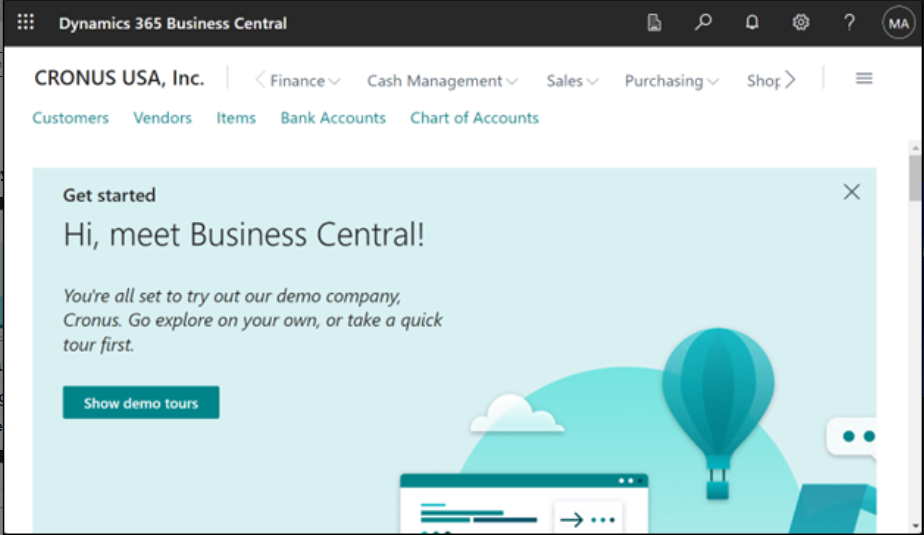

# Lab 14: Konfigurieren und Verwenden von Copilot in Dynamics 365 Business Central

## Übung 1: Anmelden für die Testversion

> Geben Sie zur
> Webseite [**https://dynamics.microsoft.com/en-us/dynamics-365-free-trial/**](urn:gd:lg:a:send-vm-keys) Wählen
> Sie *Finance and Operations* aus, und wählen Sie dann auf der
> **Dynamics 365 Business** Central-Karte die Schaltfläche Try for free
> aus.

1.  Geben Sie Ihre Anmeldeinformationen für den Office 365-Mandanten
    ein, und wählen Sie dann **Next**.

2.  Wählen Sie **Sign in** aus.

3.  Wenn Sie dazu aufgefordert werden, geben Sie Ihr Kennwort ein, und
    wählen Sie dann **Sign in**.

4.  Wählen Sie **Yes** im Stay signed in? Fenster aus.

5.  Geben Sie **Country or region** – **United Sates**, geben Sie Ihre
    Telefonnummer ein und wählen Sie dann **Get Started** aus.

6.  Wählen Sie **Skip & go to Dynamics 365 Business Central** aus.

7.  Wählen Sie **Get Started** aus.

8.  Wählen Sie **Skip survey** aus.

9.  Sie werden weitergeleitet zum **Dynamics 365 Business Central home
    page**.

## Übung 2: Konfigurieren und Verwenden von Copilot- und AI-Funktionen

### **Aufgabe 1: Konfigurieren und Verwenden von Copilot- und AI-Funktionen**

1.  Wählen Sie in Business Central oben rechts das **Suchsymbol** aus,
    suchen Sie dann nach der Seite **"Copilot & AI Capabilities"** und
    öffnen Sie sie.

2.  Beachten Sie, dass dieser Schritt nur gilt, wenn der Schalter
    **Allow data movement** oben auf der Seite "**Copilot & AI
    Capabilities** "angezeigt wird. Schalten Sie den **Allow data
    movement** Schalter ein.

1.  Die Seite listet alle verfügbaren Copilot- und KA-bezogenen
    Funktionen und ihren aktuellen Status auf, der entweder aktiv oder
    inaktiv sein kann. Die Funktionen sind in zwei Abschnitte unterteilt
    ---– einen Abschnitt für Funktionen in der Vorschau und einen für
    Funktionen, die allgemein verfügbar sind.

Sie können den Status als Active sehen, da Copilot bereits für die
Funktionen aktiviert ist. Wenn nicht, wählen Sie eine Funktion in der
Liste aus, um sie zu aktivieren, und wählen Sie dann die **Action
aktivieren** aus.

## Aufgabe 2: Hinzufügen von Marketingtext zu Artikeln

1.  Klicken Sie in Business Central in der oberen rechten Ecke auf das
    Suchsymbol, geben Sie Artikel ein und wählen Sie dann den
    entsprechenden Link aus, um eine Liste der verfügbaren Artikel
    anzuzeigen.

2.  Klicken Sie auf den ersten Punkt -- **ATHENS Desk**.

3.  Wählen Sie im Bereich **Marketing Text** in der Infobox auf der
    rechten Seite der Seite die Option **Draft with Copilot** aus.

4.  Copilot beginnt mit der Erstellung des Marketingtextes.

5.  Wenn Copilot den Entwurf fertiggestellt hat, wird der Text im
    Copilot-Editorfenster angezeigt, damit Sie ihn überprüfen und
    bearbeiten können.

### Aufgabe 3: Überprüfen, Bearbeiten und Speichern von Text

Sobald Sie den ersten Entwurf haben, müssen Sie ihn überprüfen und
Änderungen am Text vornehmen, um ihn für die Veröffentlichung
vorzubereiten. Diese Arbeit wird über den Copilot-Editor erledigt, mit
dem Sie weitere Vorschläge erhalten, Einstellungen ändern können, um die
Vorschläge zu beeinflussen, und manuell Änderungen vornehmen und den
Text formatieren können.

1.  Nehmen Sie Änderungen am Text direkt im Textfeld vor. Verwenden Sie
    die Symbolleiste am unteren Rand des Felds, um Text zu formatieren
    und zu formatieren, Links hinzuzufügen und vieles mehr. Wählen
    Sie z. B. die Überschrift aus und formatieren Sie sie fett.

2.  Um einen neuen Vorschlag zu erhalten, wählen Sie **Regenerate**.

**Hinweis:** Wenn Sie mit den Vorschlägen nicht zufrieden sind, können
Sie die Textvorschläge mit den Voreinstellungen **Tone, Format** und
**Emphasis** verbessern.

3.  Überprüfen Sie den Text sorgfältig auf Richtigkeit und
    Angemessenheit. Um den Text zu speichern, wählen Sie **Keep it**.

4.  Wenn Sie nicht speichern möchten, wählen Sie die Schaltfläche
    "Verwerfen" (Papierkorb).

### Aufgabe 4: Abgleichen von Bankkonten mit Copilot (Vorschau)

1.  Wählen Sie das Suchsymbol aus, mit dem das Featuresymbol Tell me
    more geöffnet wird, geben Sie [**[Bank Account
    Reconciliations](urn:gd:lg:a:send-vm-keys)**](urn:gd:lg:a:send-vm-keys)
    , und wählen Sie dann den entsprechenden Link aus.

2.  Wählen Sie einen vorhandenen Abgleich aus der Liste aus und öffnen
    Sie ihn.

3.  Wählen Sie auf der Karte **Bank Acc. Reconciliation** die Option
    **Reconcile with Copilot** aus.

4.  Copilot beginnt mit der Generierung von Match-Vorschlägen.

5.  Wenn der Vorgang abgeschlossen ist, werden im Fenster Reconcile with
    Copilot die Ergebnisse des Abgleichsprozesses geöffnet.

6.  Copilot bietet Ihnen die Möglichkeit, die Vorschläge zu prüfen und
    nach Belieben zu speichern oder zu verwerfen.

