Lab 14: Configuring and using Copilot in Dynamics 365 Business Central

Exercise 1: Signing up for the trial

1.  Go
    to [***https://dynamics.microsoft.com/en-us/dynamics-365-free-trial/***](urn:gd:lg:a:send-vm-keys) choose *Finance
    and operations*, and then, on the **Dynamics 365 Business
    Central** card, choose the **Try for free** button.

> 

2.  Enter your Office 365 tenant credentials and then select **Next**.

> 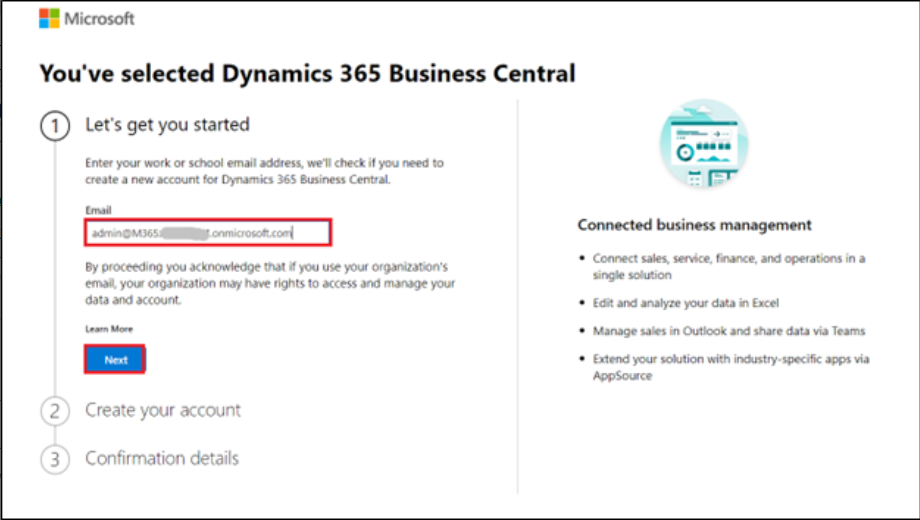

3.  Select **Sign in**.

> 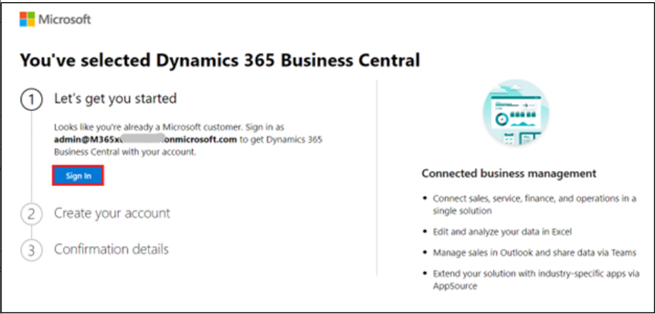

4.  If asked, enter your password, and then select **Sign in**.

> 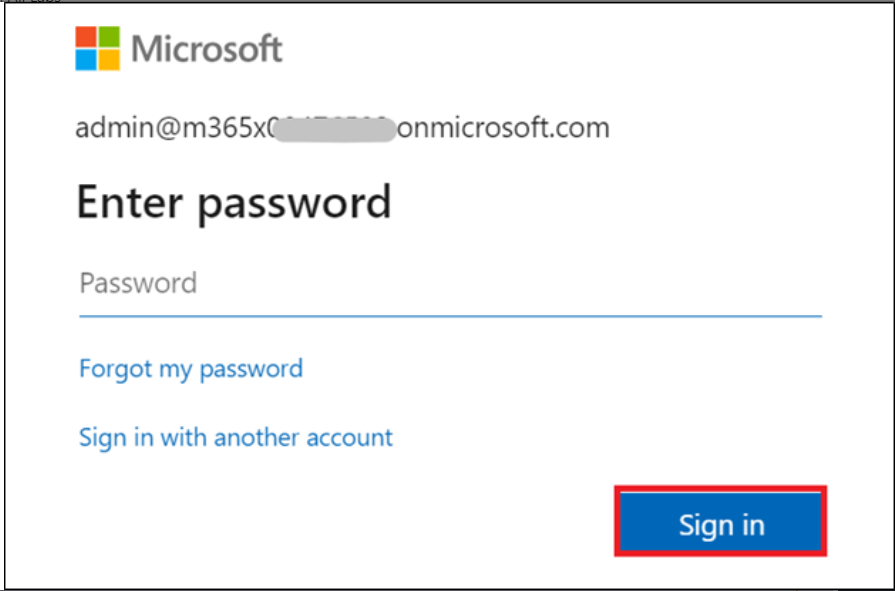

5.  If asked, select **Yes** on **Stay signed in?** window.

> 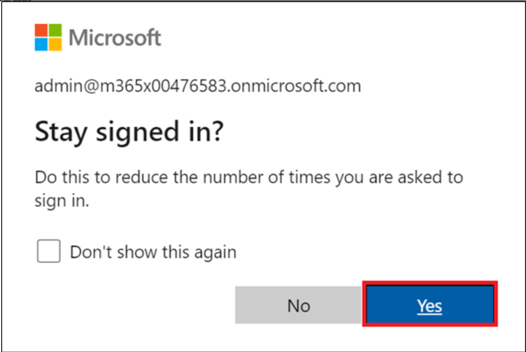

6.  Enter **Country or region** – **United Sates**, enter your phone
    number and then select **Get Started**.

> 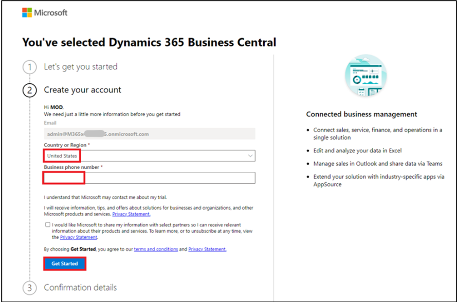

7.  Select **Skip & go to Dynamics 365 Business Central**.

> 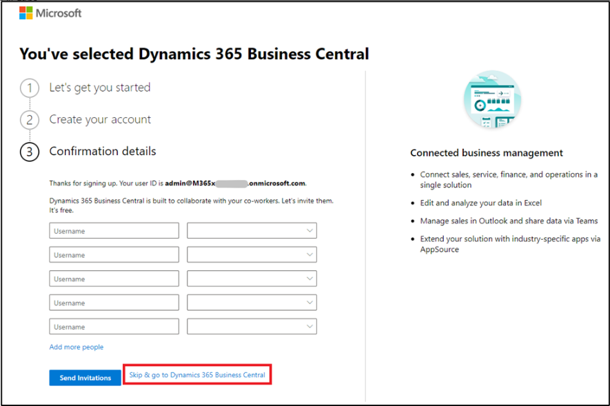

8.  Select **Get Started**.

> 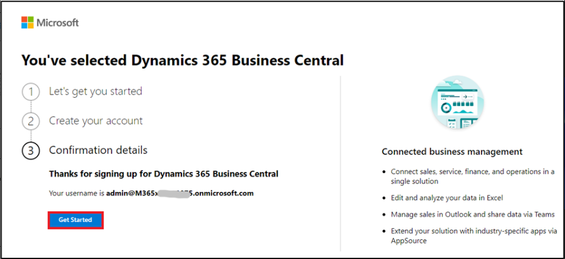

9.  Select **Skip survey**.

> 

10. You will be directed to the **Dynamics 365 Business Central home
    page**.

> 

Exercise 2: Configuring and using Copilot and AI capabilities

Task 1: Configuring and using Copilot and AI capabilities

1.  In Business Central, select **Search icon** at top right then search
    for and open the [***Copilot & agent
    Capabilities***](urn:gd:lg:a:send-vm-keys) page.

> 

2.  The page lists all available Copilot and AI related features and
    their current status, which can be either active or inactive. The
    features are divided into two sections---one section for features in
    preview and another for features that are generally available.

> You can see the status as **Active** as Copilot is already activated
> for the features. If not, to turn on a feature, select it in the list,
> then select the **Activate** action.
>
> 

Task 2: Adding marketing text to items

1.  In Business Central, the upper-right corner, click on the search
    icon, enter [***Items***](urn:gd:lg:a:send-vm-keys), and then choose
    the related link to show a list of available items.

> 

2.  Click on the first item -- **ATHENS Desk**.

> 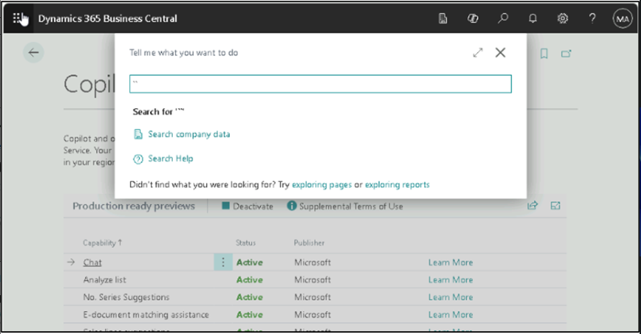

3.  In the **Marketing Text** pane in the FactBox on the right side of
    the page, select **Draft with Copilot**.

> 

4.  Copilot starts to draft the marketing text.

> 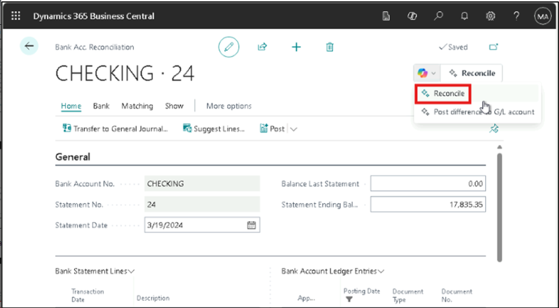

5.  When Copilot completes the draft, the text appears in the Copilot
    editor window for you to review and edit.

> 

Task 3: Review, edit, and save text

Once you have the first draft, you must review it and make changes to
the text to get it ready for publishing. This work is done from the
Copilot editor, which lets you get more suggestions, change preferences
to influence the suggestions, and manually make changes and style the
text.

1.  Make changes to text directly in the text box. Use the tool bar
    along the bottom of the box to format and style text, add links, and
    more. For example, select the heading and make it bold.

> 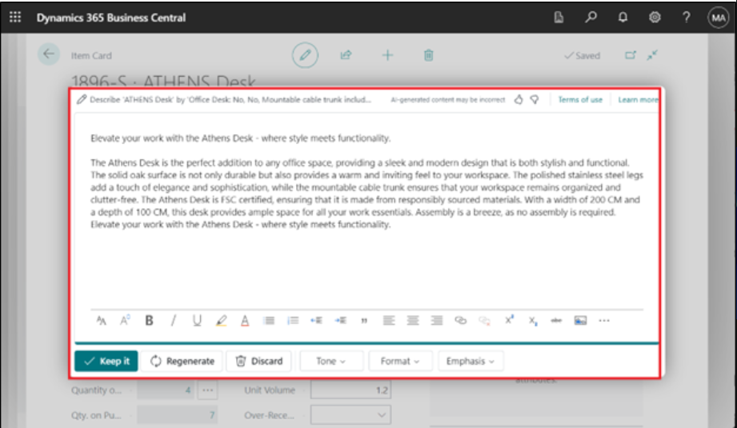

2.  To get a new suggestion, select **Regenerate**.

> 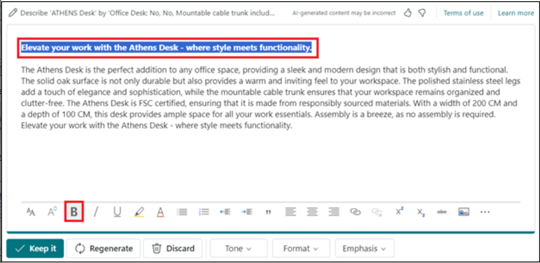
>
> **Note:** If you're not satisfied with the suggestions, enhance the
> text suggestions using the **Tone**, **Format**,
> and **Emphasis** preference options.

3.  Carefully review the text for accuracy and appropriateness. To save
    the text, select **Keep it**.

> 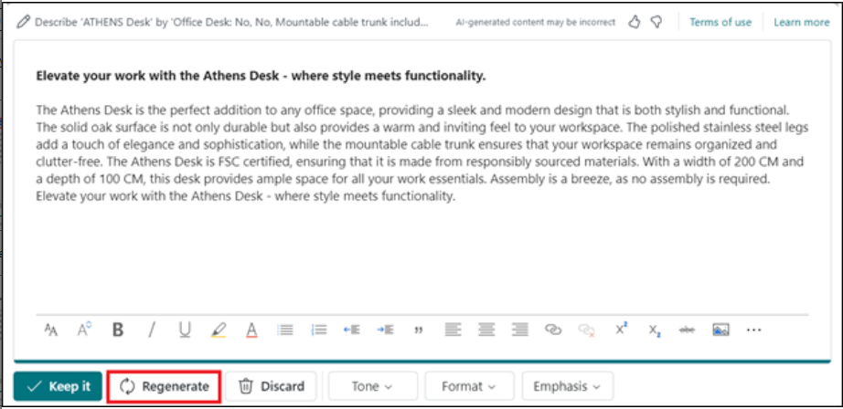

4.  If you don't want to save, select the discard button (trash can).

> 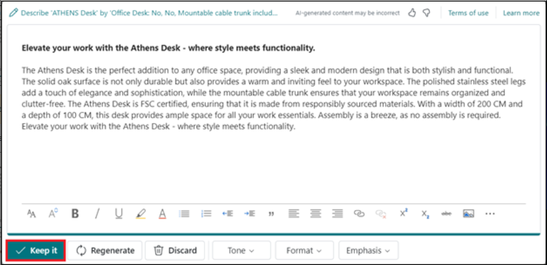

Task 4: Reconciling bank accounts with Copilot (preview)

1.  Select the search icon that opens the Tell Me feature icon,
    enter [***Bank Account
    Reconciliations***](urn:gd:lg:a:send-vm-keys), and then choose the
    related link.

> 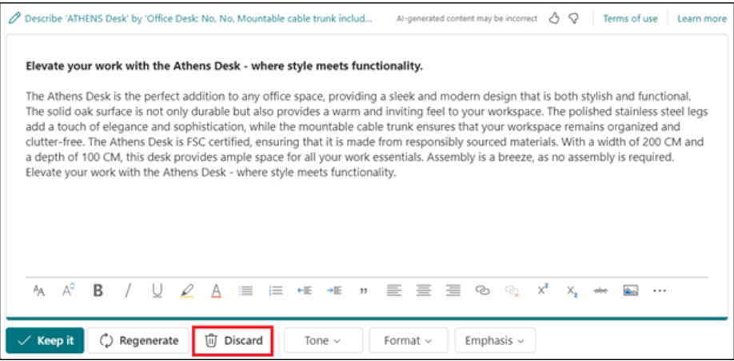

2.  Select and open an existing reconciliation from the list.

> 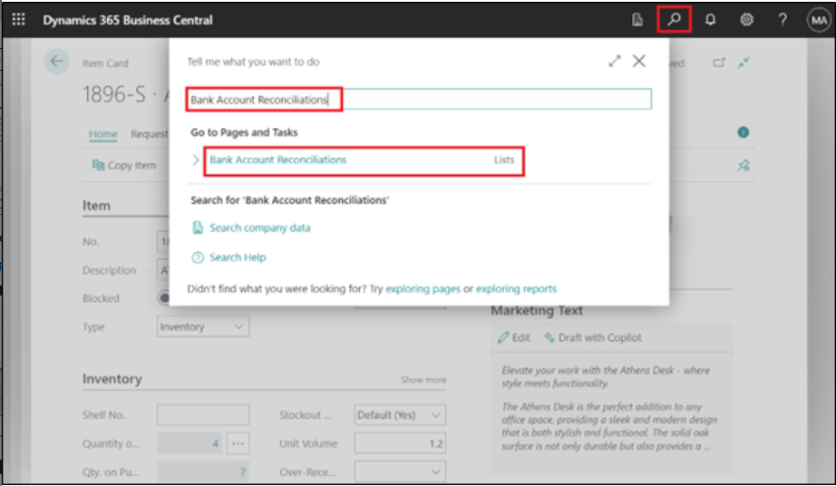

3.  In the **Bank Acc. Reconciliation** card, click
    on **drop-down** menu next to **Copilot** icon and then
    select **Reconcile**.

> 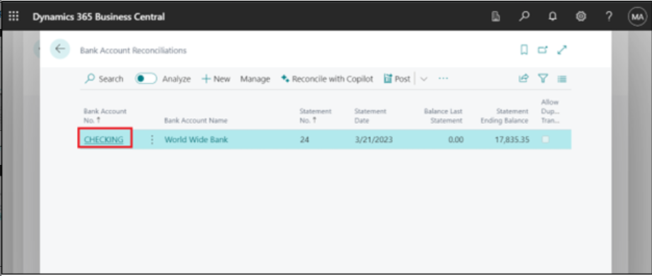

4.  Copilot starts generating proposed matches.

> 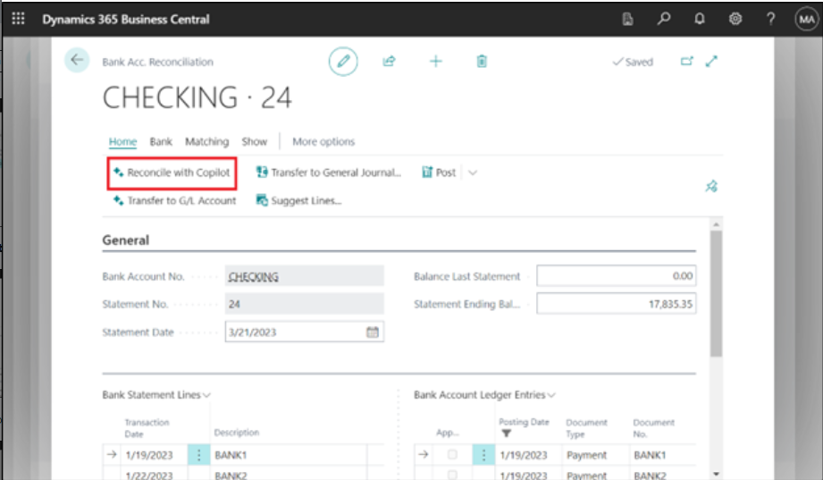

5.  When it's completed, the Reconcile with Copilot window opens the
    results of the matching process.

> 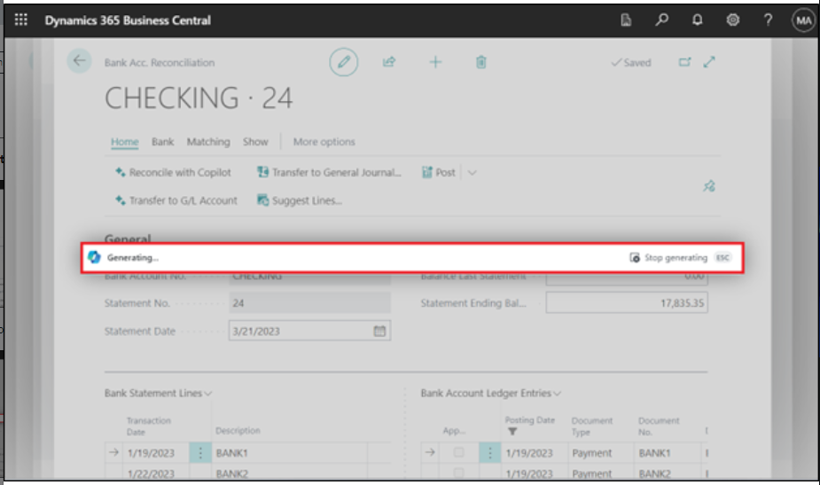

6.  Copilot provides you with opportunity inspect the proposals and save
    or discard as you like.

> 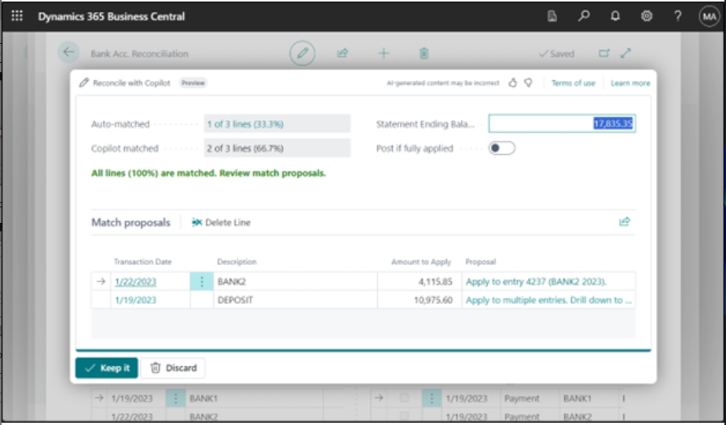
