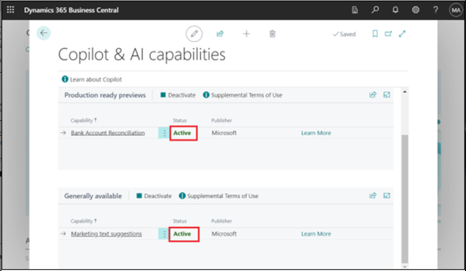
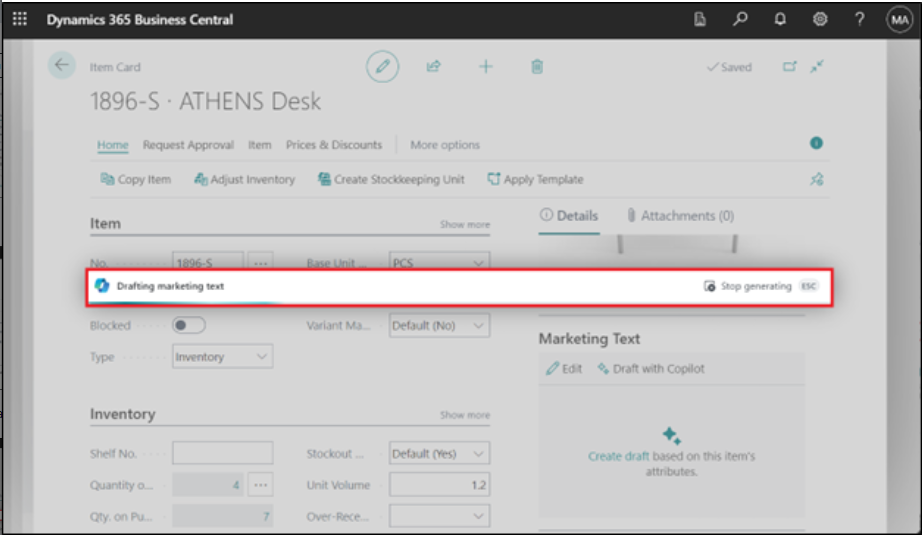

# 实验 14：在 Dynamics 365 Business Central 中配置和使用 Copilot 

## 练习 1：注册试用

1.  转到 [**https://dynamics.microsoft.com/en-us/dynamics-365-free-trial/**](urn:gd:lg:a:send-vm-keys) 选择
    Finance and operations，然后在 **Dynamics 365 Business Central**
    卡上，选择 **Try for free** 按钮。

2.  输入您的 Office 365 租户凭据，然后选择 **Next**。

3.  选择 **Sign in** （登录）。

4.  如果系统提示，请输入您的密码，然后选择 **Sign in** （登录）。

5.  在保持登录状态上选择 **Yes** ？窗。

6.  输入**国家或地区 – United Sates**，输入您的电话号码，然后选择 **Get
    Started**。

7.  选择 **Skip & go to Dynamics 365 Business Central**。

8.  选择 **Get Started**（开始使用）。

9.  选择 **Skip survey** （跳过调查）。

10. 您将被定向到 **Dynamics 365 Business Central 主页**。

## 练习 2：配置和使用 Copilot 和 AI 功能

### **任务 1：配置和使用 Copilot 和 AI 功能**

1.  在Business Central中，选择右上角的 **Search
    icon**，然后搜索并打开**Copilot & AI Capabilities**页面。

2.  请注意，只有当 **Allow data movement** 开关出现在**Copilot &
    AI功能**页面的顶部附近时，此步骤才适用。打开 **Allow data movement**
    （允许数据移动） 开关。

3.  该页面列出了所有可用的 Copilot 和 AI
    相关功能及其当前状态，可以是活动状态，也可以是非活动状态。这些功能分为两个部分---一个部分用于预览功能，另一个部分用于正式发布的功能。

您可以看到状态为“活动”，因为 Copilot
已为这些功能激活。如果没有，要打开某个功能，请在列表中选择它，然后选择
**Activate**作。

## 任务 2：向项目添加市场营销文本

1.  在 Business Central 的右上角，单击搜索图标，输入 Items
    （项目），然后选择相关链接以显示可用项目列表。

2.  单击第一项 -- **ATHENS Desk**。

3.  在页面右侧速见表的 **Marketing Text** 窗格中，选择 **Draft with
    Copilot**。

4.  Copilot 开始起草营销文本。

5.  当 Copilot 完成草稿时，文本将显示在 Copilot
    编辑器窗口中，供您查看和编辑。

### 任务 3：查看、编辑和保存文本

获得初稿后，您必须对其进行审阅并更改文本，以便为发布做好准备。这项工作是通过
Copilot
编辑器完成的，它允许您获得更多建议、更改首选项以影响建议，以及手动进行更改和设置文本样式。

1.  直接在文本框中更改文本。使用框底部的工具栏可以设置文本格式和样式、添加链接等。例如，选择标题并将其设为粗体。

2.  要获取新建议，请选择 **Regenerate** （重新生成）。

**注：**
如果您对建议不满意，请使用“**色调**”**、**“**格式**”和“**强调**”首选项来增强文本建议。

3.  仔细检查文本的准确性和适当性。要保存文本，请选择 **Keep
    it**（保留）。

4.  如果您不想保存，请选择丢弃按钮（垃圾桶）。

### 任务 4：使用 Copilot 对帐银行账户（预览版）

1.  选择打开 Tell Me （告诉我） 功能图标的搜索图标，输入 [**Bank Account
    Reconciliations**](urn:gd:lg:a:send-vm-keys)（银行账户对帐），然后选择相关链接。

2.  从列表中选择并打开现有对帐。

3.  在 **Bank Acc. Reconciliation** 卡中，选择 **Reconcile with
    Copilot**。

4.  Copilot 开始生成建议的匹配项。

5.  完成后，与 Copilot 协调窗口将打开匹配过程的结果。

6.  Copilot 为您提供了检查提案并根据需要保存或丢弃的机会。

