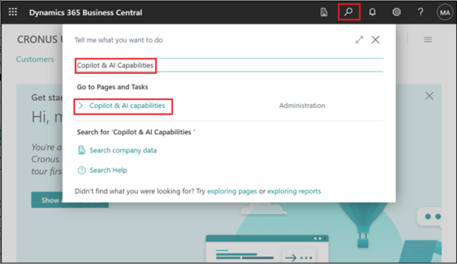
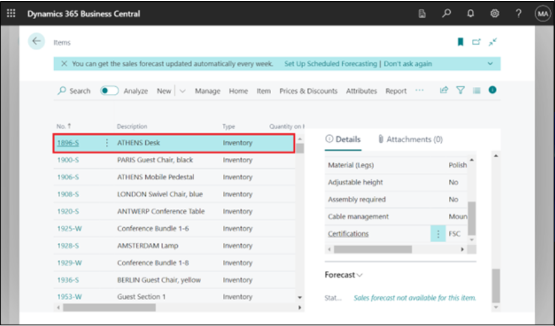

# Lab 14: Configurazione e utilizzo di Copilot in Dynamics 365 Business Central

## Esercizio 1: Iscrizione alla versione di prova

1.  Vai a
    **https://dynamics.microsoft.com/en-us/dynamics-365-free-trial/**
    scegli *Finanza e operazioni*, quindi, nella scheda **Dynamics 365
    Business Central**, scegli il pulsante **Try for free**.

2.  Immettere le credenziali del tenant di Office 365 e quindi
    selezionare **Next**.

3.  Seleziona **Sign in**.

4.  Se richiesto, immettere la password e quindi selezionare **Sign
    in**.

5.  Seleziona **Yes** nella finestra Rimani connesso?.

6.  Inserisci il **Country or region**- **United States**, inserisci il
    suoi numero di telefono e quindi seleziona **Get Started**.

7.  Seleziona **Skip & go to Dynamics 365 Business Central**.

8.  Seleziona **Get Started**.

9.  Seleziona **Skip survey**.

10. Verrà visualizzata la **Dynamics 365 Business Central home page**.

## Esercizio 2: Configurazione e utilizzo delle funzionalità di Copilot e IA

### **Attività 1: Configurazione e utilizzo delle funzionalità di Copilot e AI**

1.  In Business Central, seleziona la **Search icon** in alto a destra,
    quindi cerca e apri la pagina **Copilot & AI Capabilities**.

2.  Tieni presente che questo passaggio si applica solo se l'
    interruttore **Allow data movement** viene visualizzato nella parte
    superiore della pagina **Copilot & AI Capabilities**. Attiva
    l'interruttore **Allow data movement**.

3.  La pagina elenca tutte le funzionalità disponibili relative a
    Copilot e AI e il loro stato attuale, che può essere attivo o
    inattivo. Le funzionalità sono suddivise in due sezioni--- una per
    le funzionalità in anteprima e un'altra per le funzionalità
    disponibili a livello generale.

È possibile visualizzare lo stato come "Attivo" poiché Copilot è già
attivato per le funzionalità. In caso contrario, per attivare una
funzione, selezionarla nell'elenco, quindi selezionare l' azione
**Activate**.

## Attività 2: Aggiunta di testo di marketing agli elementi

1.  In Business Central, nell'angolo in alto a destra, fare clic
    sull'icona di ricerca, immettere Articoli, quindi scegliere il
    collegamento correlato per visualizzare un elenco di articoli
    disponibili.

2.  Clicca sulla prima voce -- **ATHENS Desk**.

3.  Nel riquadro **Marketing Text** nel riquadro Dettaglio informazioni
    sul lato destro della pagina, seleziona **Draft with Copilot**.

4.  Copilot inizia a redigere il testo di marketing.

5.  Quando Copilot completa la bozza, il testo viene visualizzato nella
    finestra dell'editor di Copilot per la revisione e la modifica.

### Attività 3: Rivedere, modificare e salvare il testo

Una volta ottenuta la prima bozza, è necessario esaminarla e apportare
modifiche al testo per prepararlo per la pubblicazione. Questo lavoro
viene svolto dall'editor Copilot, che consente di ottenere più
suggerimenti, modificare le preferenze per influenzare i suggerimenti e
apportare manualmente modifiche e stilizzare il testo.

1.  Apporta le modifiche al testo direttamente nella casella di testo.
    Utilizza la barra degli strumenti nella parte inferiore della
    casella per formattare e formattare il testo, aggiungere
    collegamenti e altro ancora. Ad esempio, seleziona l'intestazione e
    rendila in grassetto.

2.  Per ottenere un nuovo suggerimento, selezionare **Regenerate.**

**Nota:** se non siete soddisfatti dei suggerimenti, migliorate i
suggerimenti di testo utilizzando le opzioni di preferenza **Tone**,
**Format** ed **Emphasis**.

3.  Esamina attentamente il testo per verificarne l'accuratezza e
    l'adeguatezza. Per salvare il testo, selezionare **Keep it**.

4.  Se non vuoi salvare, seleziona il pulsante **Discard** (cestino).

### Attività 4: Riconciliare i conti bancari con Copilot (anteprima)

1.  Selezionare l'icona di ricerca che apre l'icona della funzionalità
    Aiutami, immettere [**Bank Account
    Reconciliationsi**](urn:gd:lg:a:send-vm-keys), quindi scegliere il
    collegamento correlato.

2.  Selezionare e aprire una riconciliazione esistente dall'elenco.

3.  Nella scheda **Bank Acc. Reconciliation**, selezionare **Reconcile
    with Copilot.**

4.  Copilot inizia a generare le corrispondenze proposte.

5.  Al termine, viene visualizzata la finestra Riconcilia con Copilot
    con i risultati del processo di corrispondenza.

6.  Copilot ti offre l'opportunità di ispezionare le proposte e salvarle
    o scartarle a suoi piacimento.

