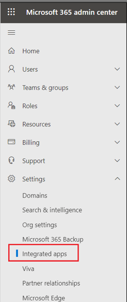
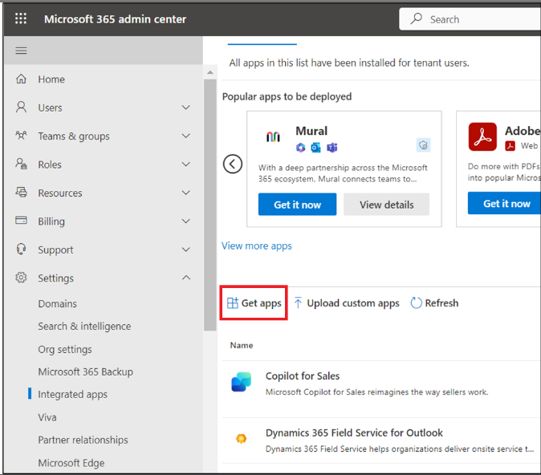

# Lab 15: Using Copilot for Finance in Outlook

## Task 1: Install the Copilot for Finance for Outlook add-in from the Microsoft 365 admin center

To install the Copilot for Finance for Outlook add-in from the Microsoft
365 admin center, follow these steps.

1.  Sign in to the Microsoft 365 admin center with the given
    link [**https://admin.microsoft.com/**](urn:gd:lg:a:send-vm-keys).

2.  In the left pane, select **Settings** \> **Integrated apps**.

3.  On the **Integrated apps** page, select **Get Apps**.

4.  In the AppSource window, search for **Copilot for Finance**.

5.  In the search results, select **Copilot for Finance for Outlook**,
    and then select **Get it now**.

6.  Click on **Get it now** on Confirm to continue window.

7.  In the **Users** step, select **Entire organization** under Assign
    users then select **Next**.

8.  In the **Deployment (Permissions)** step, review the app permissions
    and capabilities in connection with Copilot for Finance,
    select **Accept permissions**.

9.  When you see that permissions are accepted then select **Next**.

10. In the **Deployment (Finish)** step, review the selected settings,
    and then select **Finish deployment**.

11. When the deployment is completed, select **Done**.

**Task 2: Generating email summary in Demo mode, viewing contact details
and adding notes**

1.  Now, Go to Outlook, open any mail, click on **Apps** and then click
    on **Add apps**.

2.  In the search bar, type **Copilot for Finance** and then select it
    from the Apps list.

3.  Select **Add**.

4.  Click on Got it to start using Copilot for Finance.

5.  Now open Outlook and go to the email that you want to analyze. On
    the top menu for the selected email, select **All Apps**. Select
    the **Copilot for Finance** app.

6.  On the **Welcome** page, select **Try demo mode**.

7.  Click on **Next** on the pop-up window of 'Stay in the flow of your
    work'. Click on Next till you get Try now button.

8.  When you see **Try now** button, click on that.

9.  You can see email summary.

10. If you want suggestions to reply the email, click on **Suggest a
    reply**. To save, regenerate or copy the email summary, click on 3
    dots (**...**) next to Suggest a reply.

11. You can also see the customers and contacts saved in your ERP.

12. Click on the customer name **Fabrikam**.

13. You can see the customer details, outstanding invoices and related
    activities.

14. Click on the **back arrow** to come back to the home screen of
    Copilot for Finance.

15. Now scroll down and select **New note** under Notes section at the
    end.

16. You can save the note by selecting the customer that you want to
    associate the note with.
