Lab 3: Building a bot in Microsoft Copilot Studio with the new AI
capabilities

In this lab, you'll create an agent by using Copilot in Microsoft
Copilot Studio. Additionally, you'll learn how to use the Conversation
Booster feature to improve your agent's responses.

1.  Sign into **Microsoft Copilot Studio** with your **Office 365 admin
    tenant** credentials
    using **[*https://copilotstudio.microsoft.com/*](urn:gd:lg:a:send-vm-keys).**

2.  Select **United States** as your country/region and then
    select **Start free trial**.

> 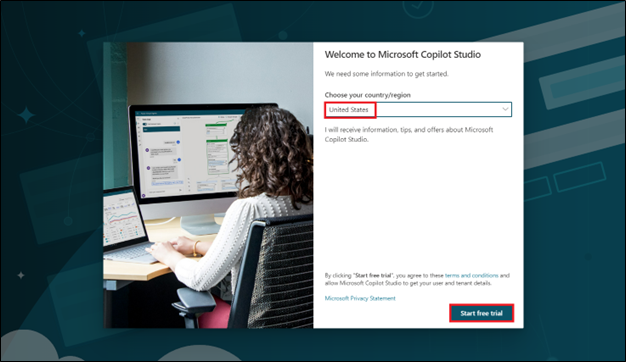

3.  Select **Dev One** environment from environment selector.

> 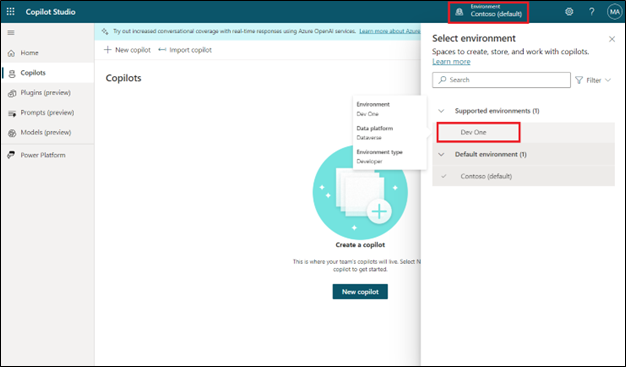

4.  On the **Welcome to Copilot Studio** pop-up, select **Skip**

> 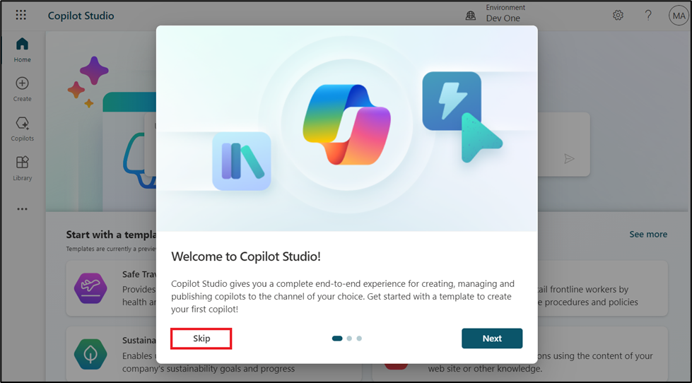

5.  Select **+ Create** from the left navigation menu and then
    select **New agent**.

> 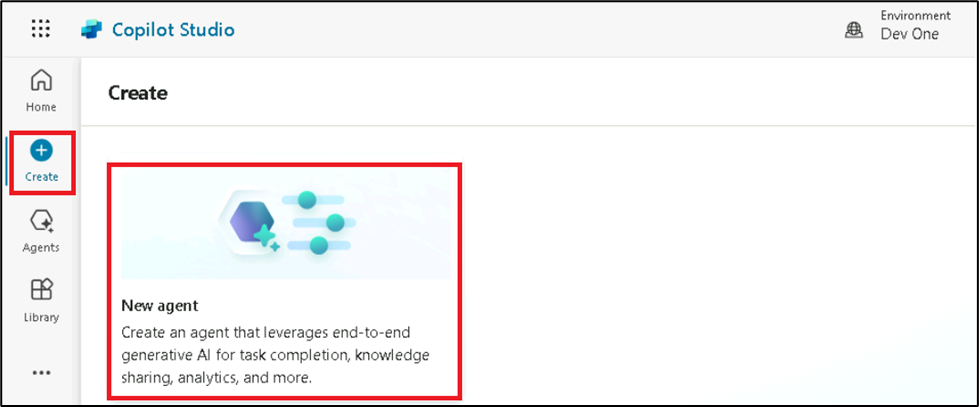

6.  Select **Skip to configure**.

> 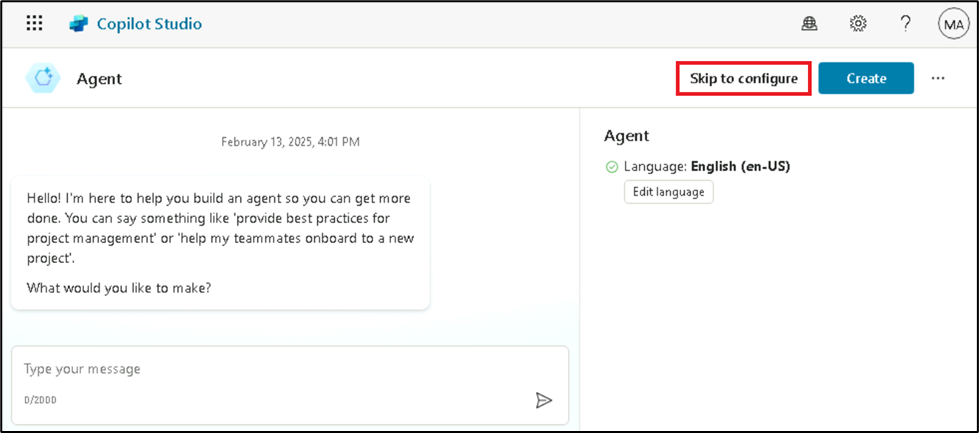

7.  Name your agent as [***Real Estate Booking
    Service***](urn:gd:lg:a:send-vm-keys) and then click on **+ Add
    knowledge**.

> 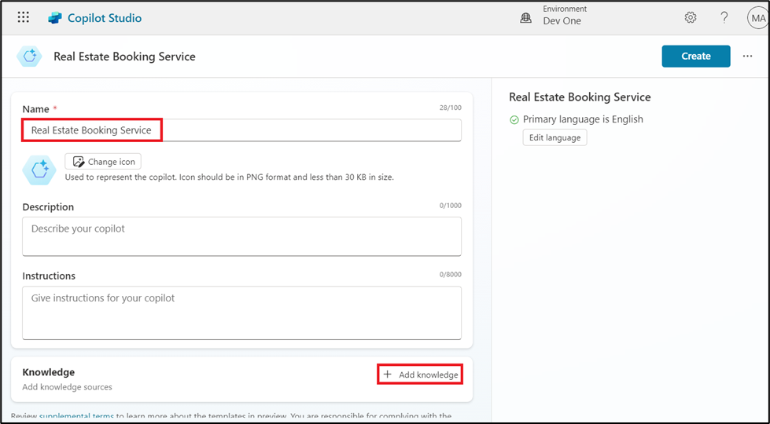

8.  Select **Public website**.

> 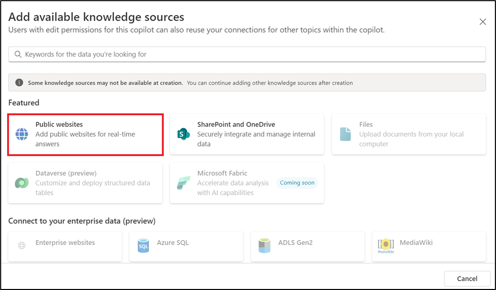
>
> **Note:** After you select **Create**, the process of creating the
> first agent within a new environment can take up to 15 minutes.
> Subsequent agents are created much faster.

9.  Under the webpage link, enter
    the [***https://powerplatform.microsoft.com/***](urn:gd:lg:a:send-vm-keys) and
    then select **Add**.

> 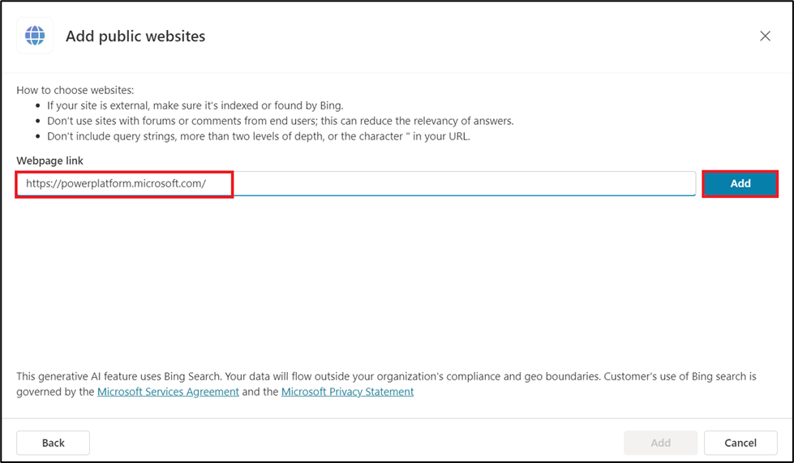

10. You can see the link added under Webpage link field, now again
    select **Add**.

> 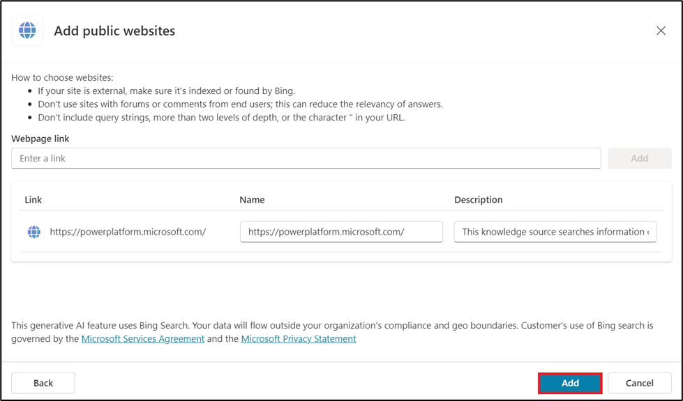

11. Select **Create**.

> 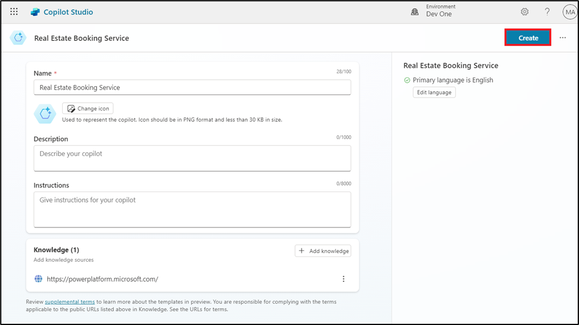

12. With your agent created, select **Topics** from the above horizontal
    pallet and then select the **+ Add a topic** dropdown menu.
    Select **Create from description with Copilot**.

> 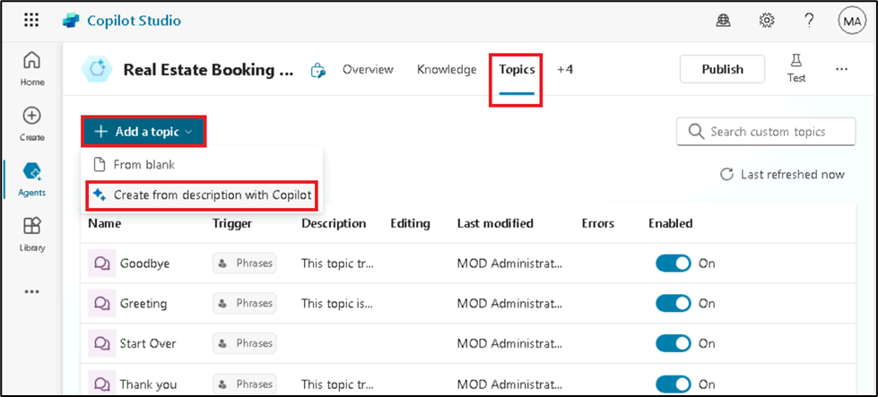

13. A new window appears asking you to **Name your topic** and provide a
    description in the **Create a topic to...** space.

14. In the **Name your topic** field, enter the following text:

> [***Book a Real Estate Showing***](urn:gd:lg:a:send-vm-keys)

15. In the Create a topic to... field, enter the following text:

> [***collect a user's full name, email, address of the property, and
> date and time of the showing***](urn:gd:lg:a:send-vm-keys)
>
> Select **Create**.
>
> 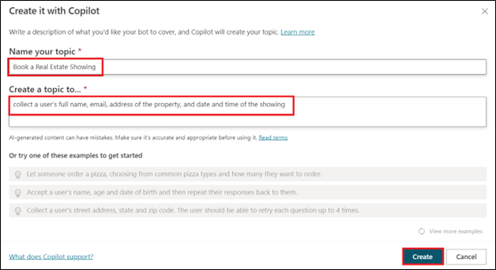
>
> A new topic displays with the generated trigger phrases.
>
> 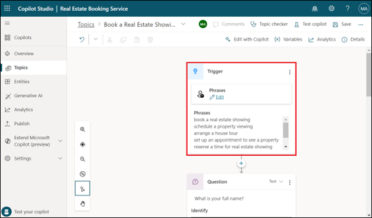
>
> **Note:** Remember, your generated content might appear differently
> than what's shown in this lab.
>
> Multiple question nodes, entity selection, and variable naming should
> also display.
>
> 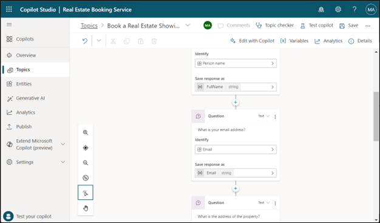

16. Look for and then select the **What is your email
    address?** question node.

> 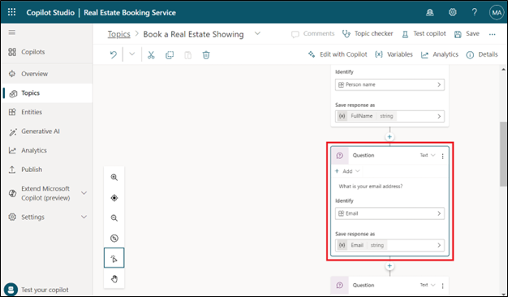

17. Select the **’What is your email address'** question node,
    select **+Add**, and then select **Message variation**.

> 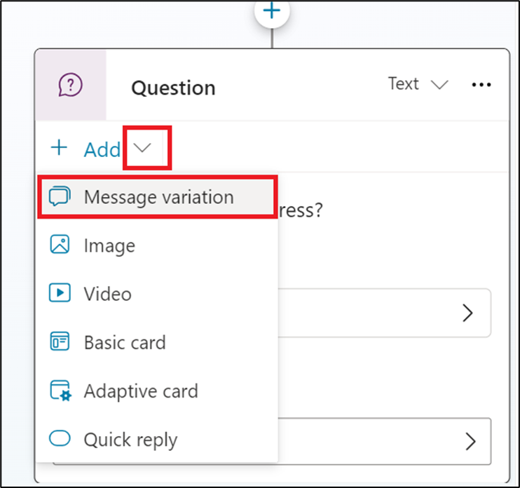
>
> Enter [***Thank you***](urn:gd:lg:a:send-vm-keys) in the message box
> and then select {X} icon to insert variable.
> Select **Name** or **FullName** variable.
>
> 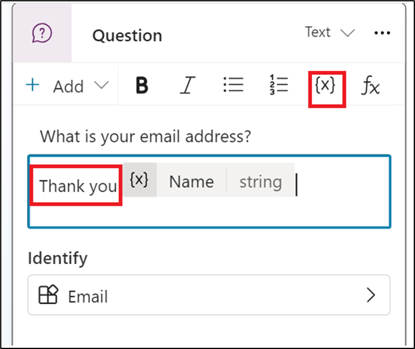

18. Select **+ sign** after the last node and select **Ask a
    question** to add one more question node.

> 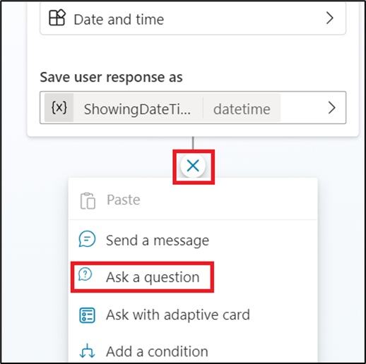
>
> Enter [***Do you want to visit again?***](urn:gd:lg:a:send-vm-keys),
> select **Multiple choice option** under **Identity**, click on **+New
> option** and enter **Yes** and **No** separately by selecting **+New
> option** twice.
>
> 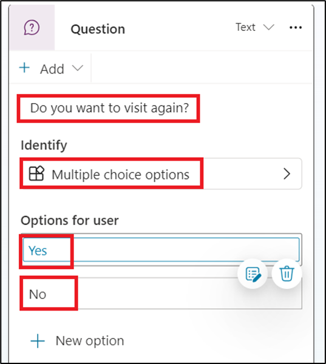

19. Select **Save** to save your changes.

> 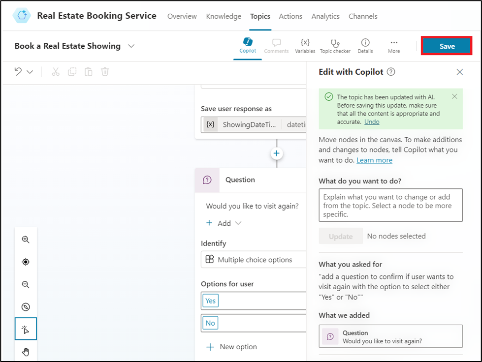

20. On right side of the screen, you can see the **Test your
    agent** pane is already opened. If not, click on **Test**.

> 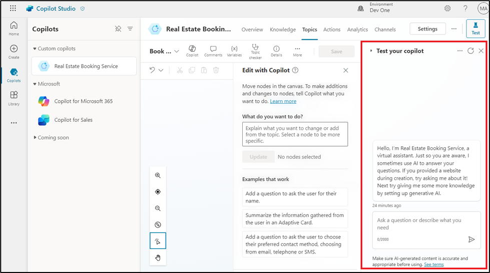

21. When the **Conversation Start** message appears, your bot will start
    a conversation. In response, enter a trigger phrase for the topic
    that you've created:

> [***I want to book a real estate showing***](urn:gd:lg:a:send-vm-keys)
>
> The bot responds with the "**What is your full name?**" question, as
> shown in the following image.
>
> 

22. Enter the rest of the information:

> Full name: Email
> address: [***abc@example.com***](urn:gd:lg:a:send-vm-keys) Address: [***555
> Oak Lane, Denver, CO 80203***](urn:gd:lg:a:send-vm-keys) Date and
> Time: [***25/02/2025 10:00 AM***](urn:gd:lg:a:send-vm-keys)
>
> 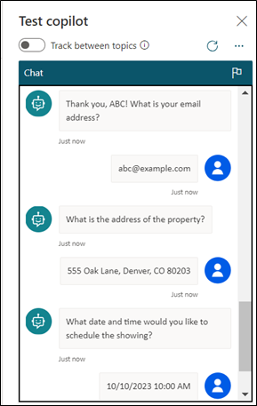

23. Select **Yes** or **No**.

> 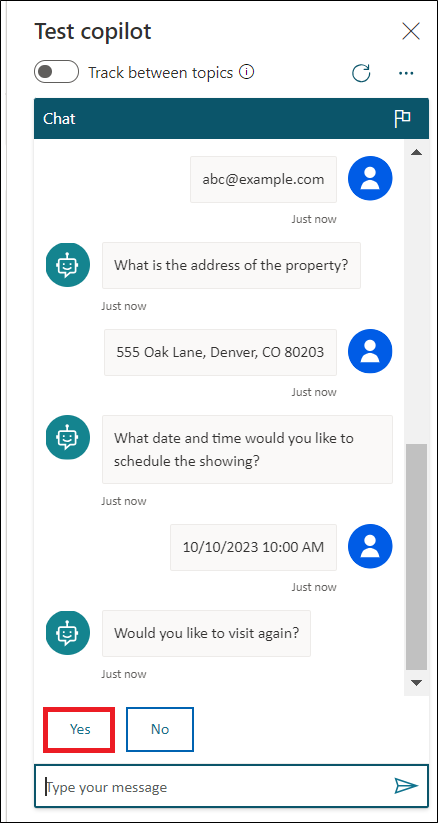

24. Enter [***What is Microsoft Power
    Platform?***](urn:gd:lg:a:send-vm-keys), the agent retrieves
    information from the website which we have provided while creating
    an agent and returns a response.

> 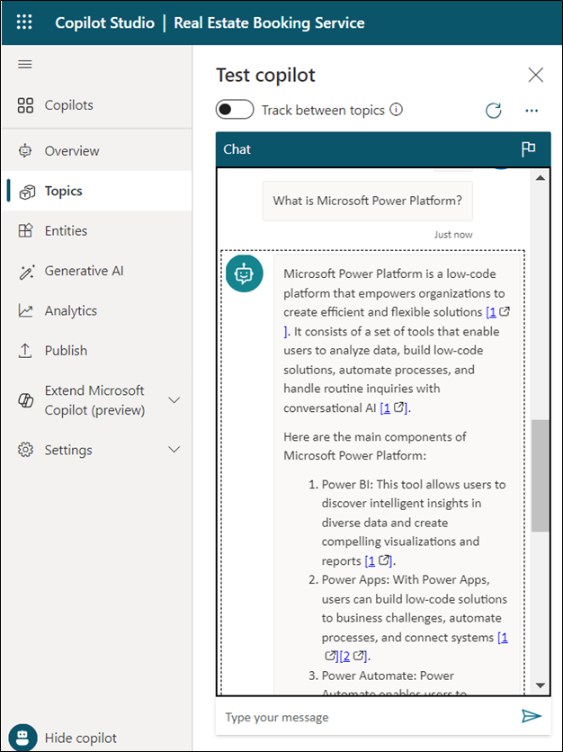
