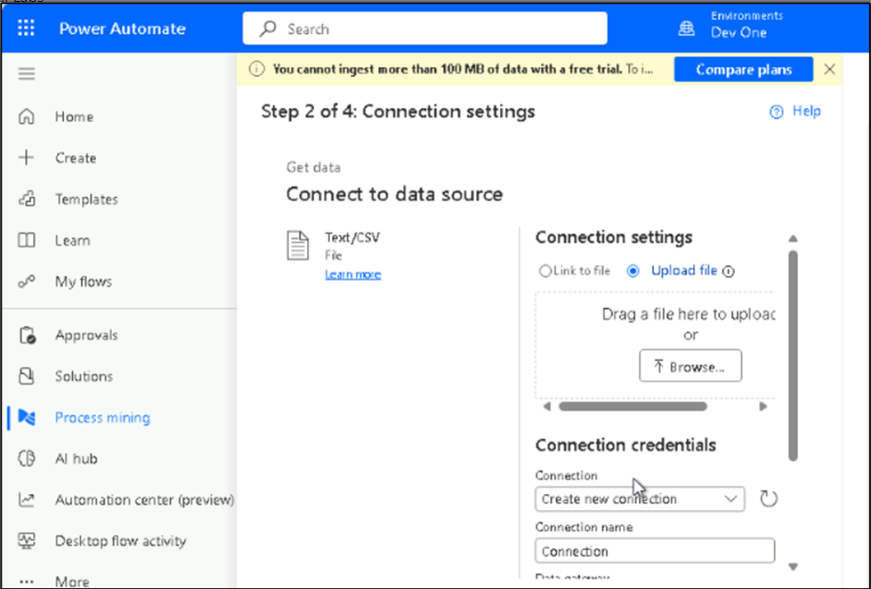

# 实验 4：在 Process Mining 中使用 Copilot 进行流程摄取和流程分析（预览版）

## 练习 1 - 在 Process Mining 中使用 Copilot 进行流程摄取

1.  使用 [**https://make.powerautomate.com/**](urn:gd:lg:a:send-vm-keys)
    导航到 Power Automate 门户。 单击 environment selector 并选择 **Dev
    One** environment （Dev One 环境）。

2.  从左侧导航栏中，选择 “**Process mining**” ，然后在 “**Create new
    process**” 下选择 “**Start here**” 。

3.  在 **Process name** （流程名称） 字段中，输入流程的名称  [**Process
    contacts**](urn:gd:lg:a:send-vm-keys) （流程联系人）。

4.  在 **Data source** （数据源） 下选择 **Import Data**（导入数据）。

5.  选择 **Dataflow**.

6.  选择 **Continue**.

7.  在 **Connect to your data** （连接到您的数据） 下，选择 **Text/CSV**
    （文本/CSV），然后选择 **Next** （下一步）。

8.  在 **Connection settings** （连接设置） 区域下，选择 **Upload file**
    （上传文件），然后单击 **Browse** （浏览）。

9.  在实验室 **VM** 中打开 **C：\LabFiles** 中的
    **Grocery_Contacts.csv** 文件。上传文件后，向下滚动并选择 **Sign
    in** （登录） 并使用您的管理员租户凭据登录。

10. 上传文件后，选择 **Next**。

11. 在 **Preview file data** （预览文件数据） 页面上选择 **Next**
    （下一步）。

12. 在 **Transform your data** （转换数据） 页面上选择 **Next**
    （下一步）。

13. 在 **Map your data**
    页面上，对于每个属性，正确映射属性类型的列以设置流程图。然后，选择
    **Save and analyze**（保存并分析）。

**注意：**案例 ID、活动和事件开始是必需的。

14. 等待报表准备好。

15. 准备好报告后，您将能够浏览该报告。浏览 **Summary** （摘要）、**Map**
    （映射） 和 **Variant DNA** （变体 DNA） 选项卡。

## 练习 2 - 在流程挖掘中使用 Copilot 进行流程分析

1.  在流程图视图中，选择右侧命令栏上的 **Copilot**。Copilot
    窗格随即打开。

2.  Copilot 提供了几个准备好的建议，让您轻松开始处理数据。

3.  从提供的建议中，选择 **Summarize my process** （汇总我的流程）。

4.  Copilot 提供对您的查询的响应。

5.  如果可用，它还会提供后续的 Prepared 建议。

6.  （可选）您可以通过选择后续建议继续与 Copilot
    对话。或者，您也可以随时使用 Copilot
    窗格底部的文本字段提出自己的问题。
